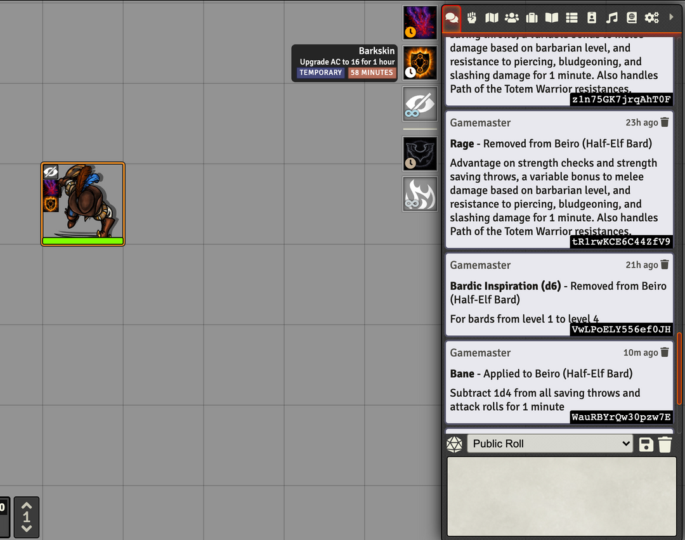

Hey all!

I recently released a new module called DFreds Effects Panel, which can be found
[here](https://foundryvtt.com/packages/dfreds-effects-panel)

On selecting a token on the canvas, this module shows a  little panel in the top
right of all the currently active effects for  that actor. From here, you can
disable them or delete them, see their details, and edit them.

Check it out!