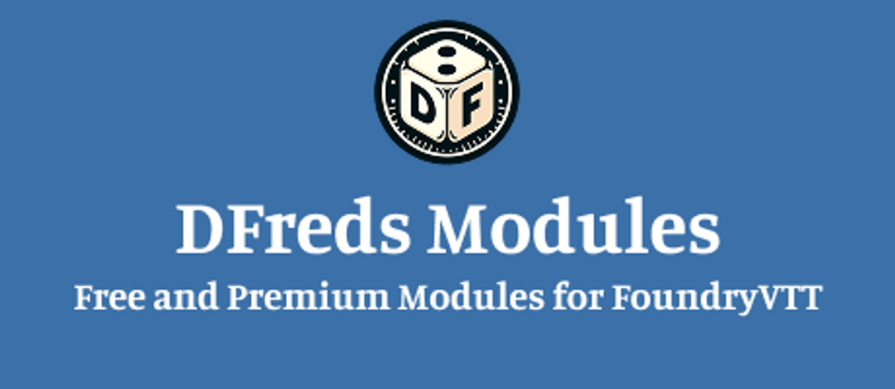

Happy to announce that DFreds Status Effects and DFreds Clipboard are both now available on the Foundry platform!

https://foundryvtt.com/packages/dfreds-clipboard 

https://foundryvtt.com/packages/dfreds-status-effects 

As long as you're subscribed to any of the tiers, you will be able to download and update them right through the Foundry interface! As this is a new setup, please let me know if you have issues and refer to the Installation guide for details on setting it up.

If you're coming from the old zip version, I recommend deleting it from your Foundry data folder and re-downloading via the Foundry interface.