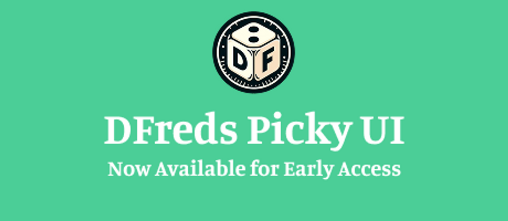

Hey everyone!

I'm announcing a new premium module: **DFreds Picky UI**.

It will be available for the Early Access tier for at least the next month, before moving to the Supporter tier. However, it could be longer if the Foundry v13 release is not out by that time.

You can download it straight from Foundry, but the Foundry page is [here](https://foundryvtt.com/packages/dfreds-picky-ui)!

For more info on it, check out the [wiki page](https://www.dfreds-modules.com/premium-modules/picky-ui/)!

**NOTE**: This is a Foundry v13 ONLY module.