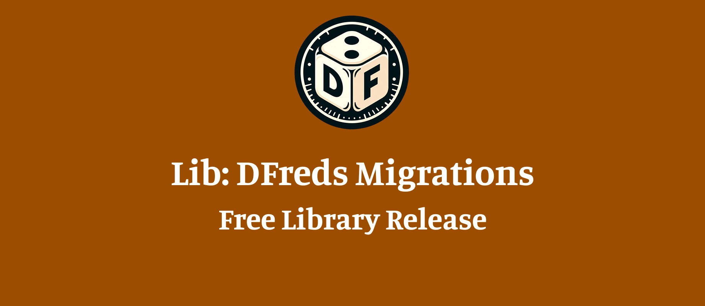

Hi all!

I've released a [new module](https://foundryvtt.com/packages/lib-dfreds-migrations) for helping developers (and myself) run migrations in their modules. 

Generally, this won't affect a standard user of Foundry, but you will likely be required to download it as a dependency in the near future for my modules like Convenient Effects and Status Effects.

For my developers, check out the [wiki page](https://www.dfreds-modules.com/developers/lib-migrations/) for details, and let me know if you have any questions.