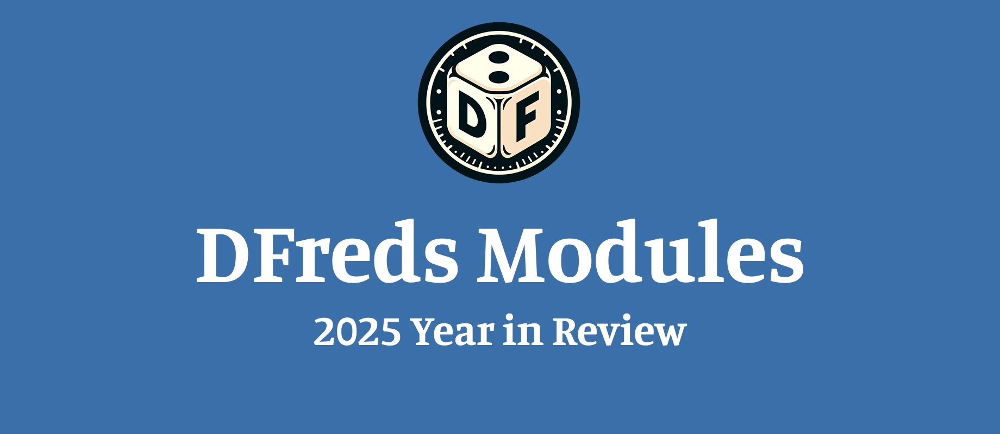

Hi all! 👋 

I figured I'd give an update on the last year of work around my modules. Some stats on 2025!

### 😮 Over 500 new Patreon members - Welcome!

### 🐝 1,316 individual commits and improvements

### ✍️ 101 individual releases across all modules

### 🎊 7 brand-new modules

### 💪 Every new and existing module updated for Foundry v13

### 🌐 A brand new [dedicated site](https://www.dfreds-modules.com/)

### 🔧 A well-maintained [Module Template](https://www.dfreds-modules.com/developers/module-template-ts/) for building your own modules

All of this is the result of hundreds of hours of work!

I wanted to give a special shout-out to my Patreon members. Without you, this wouldn't be possible. Thank you so much for your support!

For those of you who wish to support for the first time or once again, you can enjoy a 15% discount on yearly and monthly memberships with the code DFREDS2025. FYI: That stacks with the yearly discount 💰

Finally, head on over to the [Discord](https://discord.gg/5DyuBhBB) and give me some bug reports, feature requests, module ideas, or just vibe out. I'm responsive and available, and happy to hear your thoughts!

Thanks again,

-DFreds