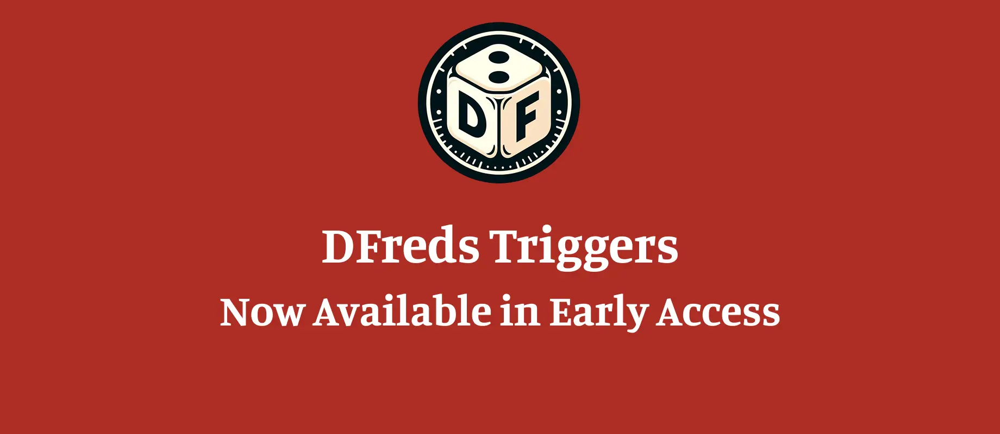

Hi everyone! 👋

I'm announcing a new premium module: **DFreds Triggers**.

It allows you to define events, conditions, and actions to help automate
your game. You pick the event to watch for, add conditions that narrow down
when it fires, and then list the actions to run. All triggers can be setup
through the interface rather than written as macros, and anything that is not a
predefined action can still run as a macro or script.

It will be available for the Early Access tier for at least the next month,
before moving to the Supporter tier.

You can download it straight from Foundry [here](https://foundryvtt.com/packages/dfreds-triggers)!

For more info on it, check out the [wiki page](https://www.dfreds-modules.com/premium-modules/triggers/).

**WARNING**: This one should truly be considered Early Access. Last time I
checked, there were 646 unique combinations of events and actions, and that's
not considering the conditions that alter when events fire and the fact that a
single event can fire multiple actions.
