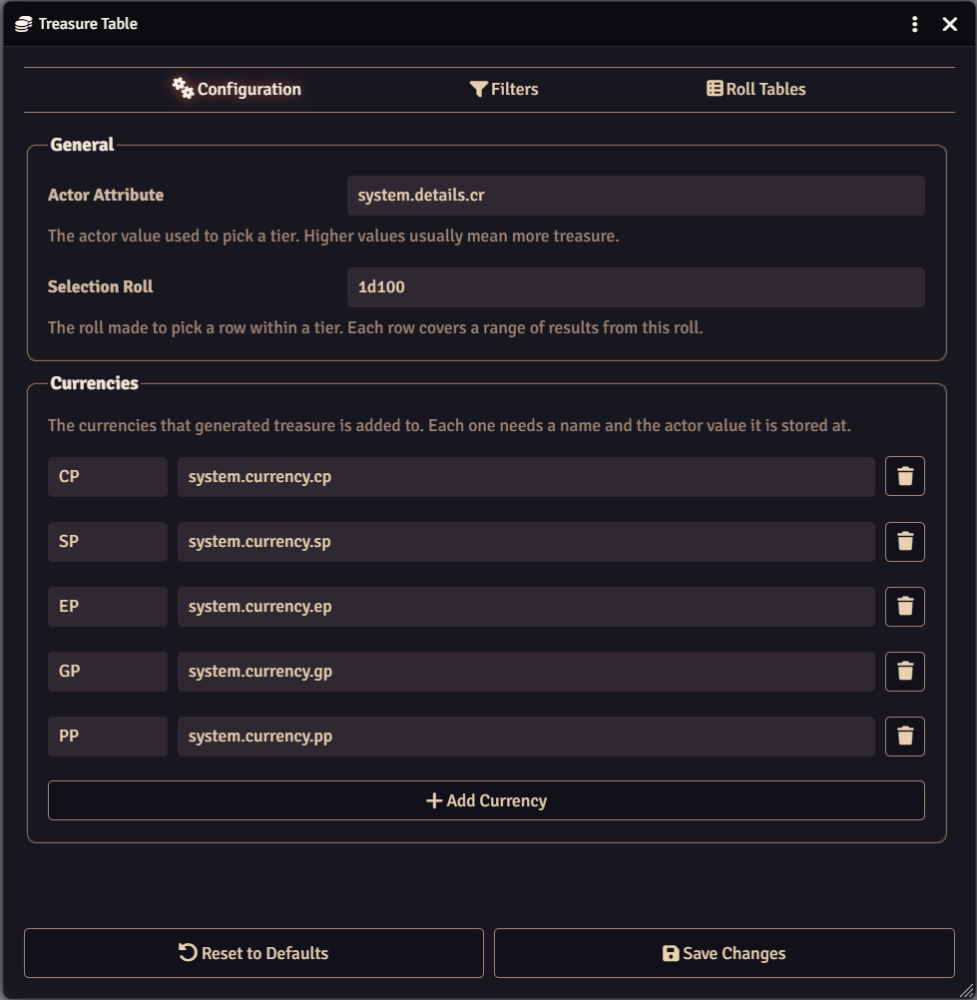

Hi everyone! 👋

**DFreds Pocket Change** has been sitting untouched for a couple of years. It's
back, rebuilt from the ground up, and it works in Foundry v14.

If you haven't used it before, it puts money on an actor so your players have
something to loot. Drop a token on the canvas and the module rolls up currency
for it and writes it onto the actor.

Here's what changed:

- **System Agnostic**: It used to be a dnd5e module only. Now, you can
  configure it for any system.
- **Treasure Configuration**: Everything can now be configured under the new
  configuration menu in the settings.
- **New Filters**: Filters help you automate when a token generates currency,
  and when one does not. Not everyone carries change around in their pockets
  (especially if they don't have pockets)!
- **Generate Currency**: Every actor sheet has a **Generate Currency** control
  in its header for GMs, which ignores filters and replaces what the actor is
  carrying.
- **Detailed Chat Messages**: Turn on the chat message setting and every roll
  and its result is posted to GMs, along with the currency the actor ended up
  with.

On dnd5e, it defaults to the Individual Treasure tables by Challenge Rating
from the Dungeon Master's Guide (like it did before).

It's free and available for everyone right now!

You can download it straight from Foundry
[here](https://foundryvtt.com/packages/dfreds-pocket-change)!

For more info on it, check out the
[wiki page](https://www.dfreds-modules.com/free-modules/pocket-change/)!
