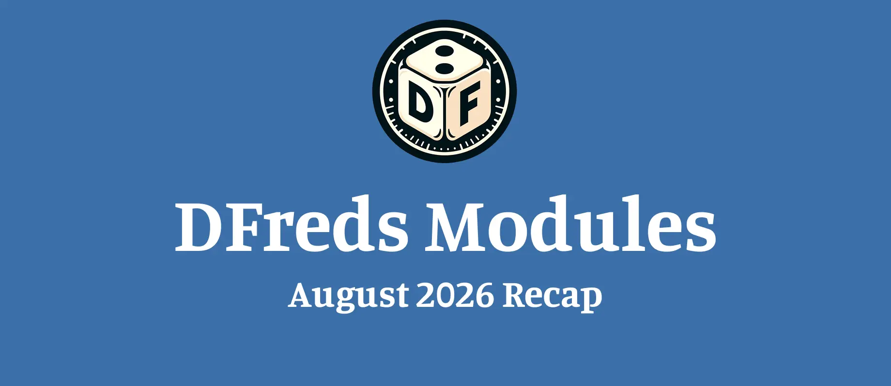

Hey all! I'm starting a monthly recap series to help keep people informed on
some detailed changes.

Here is what changed across my modules this month!

## Premium Modules

### DFreds Triggers
*v1.0.0 to v1.1.0*

**New**
- DFreds Triggers is now out, letting you set up automatic reactions to what happens in your game.
- You can now split any and all conditions into separate blocks.
- Autocomplete gives better suggestions while you build document changes and conditions.

**Fixed**
- Triggers no longer set each other off in unintended loops.

### DFreds Status Effects
*v3.2.0 to v3.2.2*

**New**
- The status effects configuration screen has a fresh look.
- A new button lets you duplicate an existing status effect.

**Fixed**
- Importing no longer stops partway when the file contains a value the module does not support.
- Your effects are sorted right after an import finishes.
- The configuration screen refreshes itself once an import finishes.

### DFreds Comprehensive Keybinds
*v2.0.1*

**Fixed**
- The module links now point to the right places.

## Free Modules

### DFreds Pocket Change
*v6.0.0*

**New**
- The module now works with Foundry version 14.
- The module now works with any game system.
- A new treasure configuration menu lets you decide what your creatures carry.
- Chat messages now show the roll behind the loot.

### DFreds Convenient Effects
*v9.2.3 to v9.2.6*

**New**
- Effects can now work together with DFreds Triggers.

**Fixed**
- Importing no longer stops partway when the file contains a value the module does not support.

### DFreds Droppables
*v6.2.1*

**Fixed**
- Dropping now places things on the correct level.

### Lib: DFreds UI Extender
*v2.5.0*

**New**
- Developers can now register a settings button that puts their module's settings right in the settings sidebar.

**Fixed**
- Directory names in the registration config are now translated properly.

### Lib: DFreds Migrations
*v1.0.4*

**Fixed**
- Registering migrations without adding any no longer causes an error.
