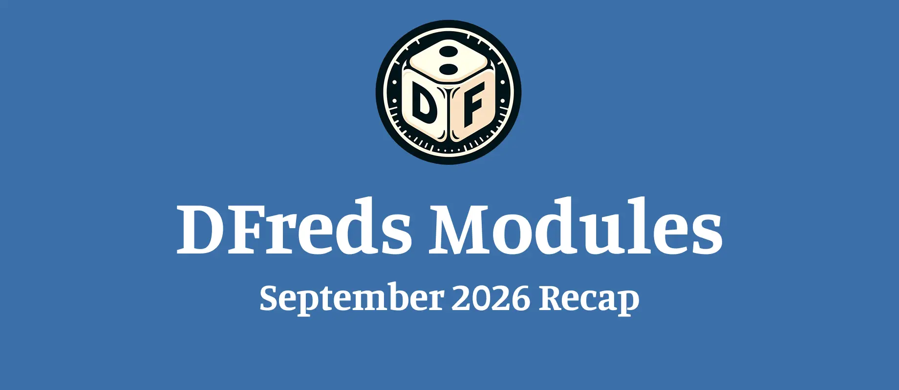

Hope the start of fall has treated your tables well.

Here is what changed across my modules this month!

## Premium Modules

### DFreds Triggers
*v1.2.0*

**New**
- You can turn on a button in the Settings sidebar that opens your trigger list.
- When you import the examples, you now choose which set to import: basic, complex, or dnd5e.
- Triggers now support events and actions specific to dnd5e, which are explained in the wiki.
- There are 14 new dnd5e examples you can import.

### DFreds Status Effects
*v3.2.3 to v3.2.4*

**New**
- A new button in the Settings sidebar opens the status effects configuration, as long as you have the latest Lib: DFreds UI Extender.
- Status effects work better with the leveled effects in DFreds Convenient Effects.

### DFreds Comprehensive Keybinds
*v2.1.0*

**New**
- A new keybinding closes all open windows, so you can set Shift+Escape to close everything while Escape still closes only the active window, and it has no key set by default.

## Free Modules

### DFreds Effects Panel
*v6.2.2 to v6.2.3*

**New**
- The panel now shows effects that have their icon set to always show.

**Fixed**
- Switching scenes no longer causes an error in the console.

### DFreds Convenient Effects
*v9.2.7*

**New**
- Effects now work with the leveled effects added in dnd5e 6.
- Your effects are moved over to leveled effects when you use dnd5e 6 or later.
