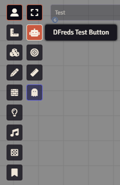
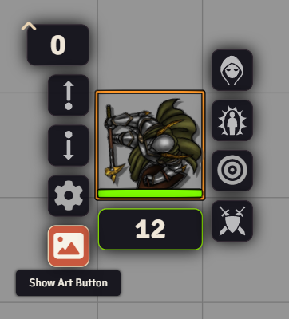

# Lib: UI Extender


<a target="_blank" href="https://foundryvtt.com/packages/lib-dfreds-ui-extender"></a>
<br />
<a target="_blank" href="https://github.com/DFreds/lib-dfreds-ui-extender"></a>

<a target="_blank" href="https://forge-vtt.com/bazaar#package=lib-dfreds-ui-extender"></a>
<br/>
<br/>

A FoundryVTT module library that adds easy ways to extend the base Foundry UI.

## Features

- Easily add new scene controls to any layer controls (token, tiles, drawings, walls, etc.)
- Easily add new HUD controls to tokens, tiles, or drawings
- Fully typed library included in repository for Typescript projects

## Usage

To use this in your own module, you can do any of the following:

- Use the `uiExtender.init` hook (which fires based on Foundry's `init` hook) and register your UI elements on the provided instance of `uiExtender`
- Use the `window.UiExtender` (accessible as just `UiExtender` in console and code) and register in Foundry's init method.

:::info
Everything will be ready to render when the Foundry `setup` hook is complete.
:::

:::tip
Check the [Migration Guides](./migration-guides) for details on updating a module
between Foundry Versions.
:::

## Hooks

Lib: DFreds UI Extender provides a few hooks.

- `uiExtender.init` - This is called once on Foundry's `init` hook. It should be used to register your controls using the provided instance of `uiExtender`.
- `uiExtender.setup` - This is called once on Foundry's `setup` hook. At this point, all controls will be created and available when they render.

## API Methods

Currently, these are the supported API methods:

### Register Scene Control

A scene control is a button that is located on a specific layer. Under the hood,
this uses the `getSceneControlButtons` hook.



```js
registerSceneControl(input: SceneControlInput)
```

For the type information for `SceneControlInput`, look at the types defined in
the repository [here](https://github.com/DFreds/lib-dfreds-ui-extender/blob/main/types/uiExtender/index.d.ts).

An example:

```js
export function mySampleModule() {
  Hooks.once("uiExtender.init", (uiExtender) => {
    uiExtender.registerSceneControl({
      moduleId: MODULE_ID,
      name: "tokens",
      tool: {
        name: "testing-button",
        title: "DFreds Test Button",
        icon: "fas fa-robot",
        button: true,
        order: 2,
        onChange: (event, active) => {
          console.log("onChange", event, active);
          ui.notifications.info(`You clicked me! Active: ${active}`);
        },
      },
    });
}
```

### Register HUD Button

A HUD button is a button located located on a specific item on the canvas when you right click. Under the hood, this uses the `render${type}HUD` hook.



```js
registerHudButton(input: HudButtonInput)
```

For the type information for `HudButtonInput`, look at the types defined in
the repository [here](https://github.com/DFreds/lib-dfreds-ui-extender/blob/main/types/uiExtender/index.d.ts).

Some examples:

```js
export function mySampleModule() {
  Hooks.once("uiExtender.init", (uiExtender) => {
    uiExtender.registerHudButton({
      moduleId: MODULE_ID,
      hudType: "token",
      tooltip: "Show Art Button",
      icon: `<i class="fas fa-image fa-fw"></i>`,
      location: "div.left",
      onClick: (
        _event: JQuery.ClickEvent,
        _button: JQuery,
        _token: any,
      ) => {
          console.log("clicked");
      },
      onRightClick: (
        _event: JQuery.ContextMenuEvent,
        _button: JQuery,
        _token: any,
      ) => {
          console.log("right clicked");
      },
    });

    uiExtender.registerHudButton({
      moduleId: MODULE_ID,
      hudType: "tile",
      tooltip: "Show Art Button",
      icon: `<i class="fas fa-image fa-fw"></i>`,
      location: "div.left",
      onClick: (
        _event: JQuery.ClickEvent,
        _button: JQuery,
        tile: any,
      ) => {
        new ImagePopout(tile.texture, {
          title: "Tile Image",
          shareable: true,
        }).render(true);
      },
      onRightClick: (
        _event: JQuery.ContextMenuEvent,
        _button: JQuery,
        tile: any,
      ) => {
        new ImagePopout(tile.texture, {
          title: "Tile Image",
          shareable: true,
        }).render(true);
      },
    });

    uiExtender.registerHudButton({
      moduleId: MODULE_ID,
      hudType: "drawing",
      tooltip: "Say Hi",
      icon: `<i class="fas fa-robot fa-fw"></i>`,
      location: "div.right",
      onClick: (
        _event: JQuery.ClickEvent,
        _button: JQuery,
        drawing: any,
      ) => {
        ui.notifications.info(
            `Hello from drawing ${drawing.fillColor}`,
        );
      },
    });
  })
}
```

## Handlebar Helpers

A few handlebar helpers have also been registered to make common use cases easier.

### Compare

This will help in conditionally rendering some HTML depending on two values and the operator provided.

Operators include:

- `==`
- `===`
- `!=`
- `!==`
- `<`
- `>`
- `<=`
- `>=`
- `typeof`

```hbs
{{#compare myDataString.length ">" "the string I want"}}
    <p>myDataString is longer than the string I want!</p>
{{else}}
    <p>myDataString is equal to or shorter than the string I want!</p>
{{/compare}}
```

```hbs
{{#compare "Test" "Test"}}
    Default comparison of "==="
{{/compare}}
```

### Is GM

This will help in conditionally rendering some HTML depending on if the user is a GM or not.

```hbs
{{#if (isGm)}}
    <button class="view-backups">
        <i class="fas fa-arrow-rotate-left"></i>
        My GM Button
    </button>
{{/if}}
```

### Strip HTML

This will remove any HTML elements from a provided string.

```hbs
<h4><a title="{{stripHtml myHtmlString}}">Some link</a></h4>
```
