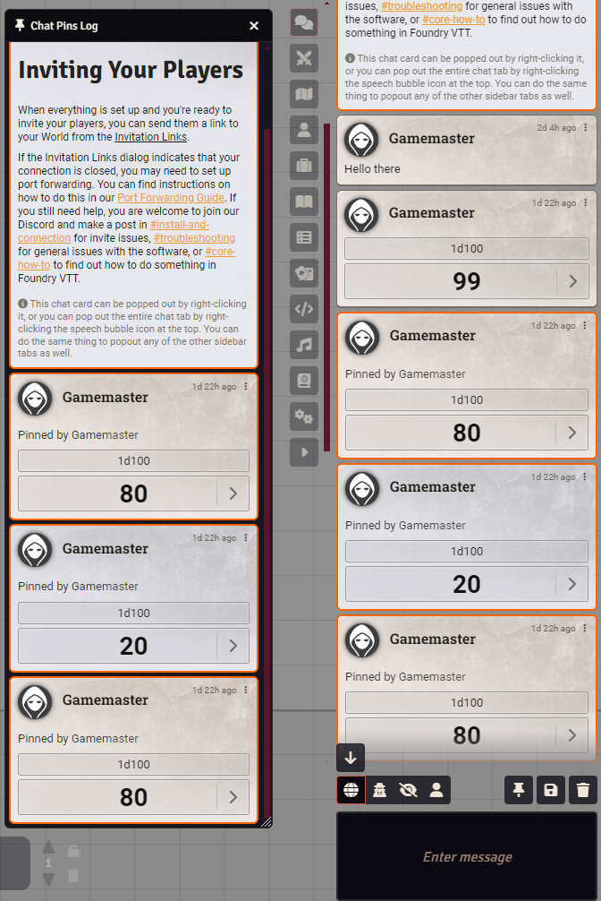
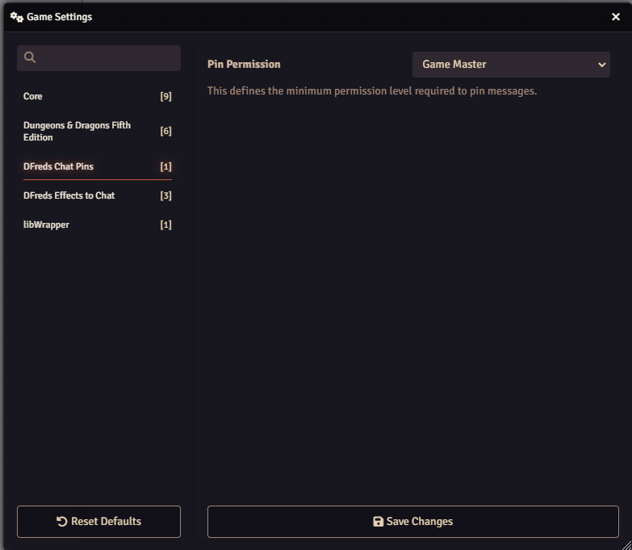

# Chat Pins

 

 
 

A module that allows pinning messages to the chat.

## Overview

Chat Pins enhances Foundry VTT's chat functionality by allowing you to save and
organize important messages for future reference. Rather than scrolling through
chat history or losing messages when clearing chat, you can now pin critical
information, rolls, or conversations with a simple right-click.

The module adds a dedicated Chat Pin Log that serves as a curated collection of
your pinned messages, accessible via a pin icon above the chat box. From this
log, you can easily manage your pins and quickly jump back to the original
message context in the main chat. When you clear the chat log, your pinned
messages remain preserved, ensuring you never lose important information.

## Features

- Easily pin or unpin any message by right-clicking it
- View an entirely separate chat log of all the pinned messages by pressing the button above the message box
- Jump to the location of the pin in the main chat log by right-clicking it in the pinned chat log
- When flushing the entire chat log, all pinned messages will remain

## Configuration

Settings are provided to configure the module.

## Required Modules

- [libWrapper](https://foundryvtt.com/packages/lib-wrapper) by ruipin - A
  library that wraps core Foundry methods to make it easier for module
  developers to add functionality. Note that if you for some reason don't want
  to install this, a shim will be used instead.