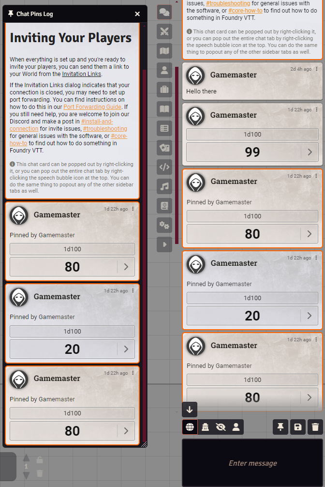

# Chat Pins

 

 
 

A FoundryVTT module that allows pinning messages to the chat.

## Overview

Chat Pins lets you right-click any chat message to pin it. Pinned messages
collect in a separate Chat Pin Log, opened from the pin icon above the chat box,
where you can manage them or jump back to the original message. Flushing the
chat log leaves them intact.

## Features

- Easily pin or unpin any message by right-clicking it
- View an entirely separate chat log of all the pinned messages by pressing the button above the message box
- Jump to the location of the pin in the main chat log by right-clicking it in the pinned chat log
- When flushing the entire chat log, all pinned messages will remain

## Settings

| Setting            | Scope | Default     | Description                                         |
| ------------------ | ----- | ----------- | --------------------------------------------------- |
| **Pin Permission** | World | Game Master | The minimum role required to pin or unpin messages. |

**Pin Permission** accepts Player, Trusted Player, Assistant GM, Game Master, or
None. Choosing None disables pinning for everyone.

:::info
Meeting the role requirement lets you pin messages you own outright. Pinning
messages owned by *other* people additionally needs socketlib, since those
requests are routed through a connected GM - see below.
:::

## Required Modules

- [libWrapper](https://foundryvtt.com/packages/lib-wrapper) by ruipin - A
  library that wraps core Foundry methods to make it easier for module
  developers to add functionality. Note that if you for some reason don't want
  to install this, a shim will be used instead.

## Recommended Modules

- [socketlib](https://foundryvtt.com/packages/socketlib) by Farling -
  Allows any user with the required role to pin any message, by routing the
  request through a connected GM. Without it, users can only pin and unpin
  messages they own, and the option is hidden entirely on messages they do not.
