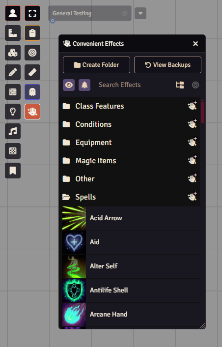

# Convenient Effects

 

 
 

A module that allows creation of easy-to-use toggleable active effects.

Currently, the DND5e and SW5e systems come with pre-created effects, but any
system can create their own effects.

## Overview

Convenient Effects collects toggleable active effects into their own sidebar
directory, so applying or removing one is a click rather than a trip through an
actor sheet. DND5e and SW5e ship with dozens of pre-built effects covering the
common spells and conditions, and any system can define its own. The bundled
effects are built to work with Midi-QoL, DAE, and Times Up, which handle
automatic duration and condition tracking.

## Features

- Adds a new application as a sidebar directory
- Provides a repository to create and share easy-to-use toggleable active effects
- Includes dozens of pre-built effects for the DND5e and SW5e systems
- First-class support for popular modules, such as Midi-QoL, Times Up, DAE, Active Token Lighting, and Token Magic FX
- Extensive API for use in macros

## Quick Start

1. Open the application with the button on the sidebar directory
1. Select a token and click an effect to toggle it on or off

## Advanced Usage

If you are a regular user, see the [User Guide](./user-guide) for more details
on all the features provided.

If you are a developer or want to learn how to write macros using the API, check
out the [Developer Guide](./developer-guide).

## Required Modules

- [libWrapper](https://foundryvtt.com/packages/lib-wrapper) by ruipin - A
  library that wraps core Foundry methods to make it easier for module
  developers to add functionality. Note that if you for some reason don't want
  to install this, a shim will be used instead.
- [socketlib](https://foundryvtt.com/packages/socketlib) by Farling - A
  library that makes it easy to do difficult things with sockets
- [Lib: DFreds UI Extender](https://foundryvtt.com/packages/lib-dfreds-ui-extender) by DFreds - A library that makes it easy to add new UI elements to Foundry
- [Lib: DFreds Migrations](https://foundryvtt.com/packages/lib-dfreds-migrations) by DFreds - A library that makes it easy to handle data migrations

## Helpful Modules

While not strictly required, the functionalities provided by these modules
drastically improve the usage of the various effects included in this module.

- [Times Up](https://foundryvtt.com/packages/times-up) by tim posney - Deletes
effects when their time is up or after a certain number of rounds or turns
- [DAE](https://foundryvtt.com/packages/dae) by tim posney - With midi-qol,
handles various additional expiration effects such as after 1 attack or when an
enemy is attacked
- [Midi-QOL](https://foundryvtt.com/packages/midi-qol) by tim posney - Handles a
vast amount of automation relating to advantage and disadvantage
- [Token Magic FX](https://foundryvtt.com/packages/tokenmagic) by SecretFire -
Certain effects and spells can have an effect applied, and this module allows
active effects to do that. Note that this requires DAE active as well.