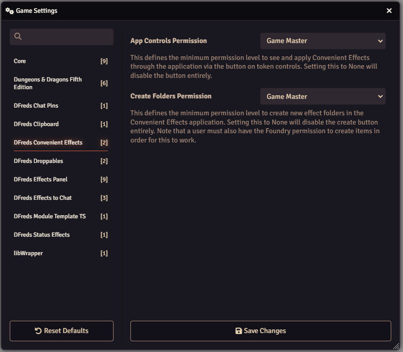

# DFreds Convenient Effects

 

 
 

A module that adds easy to use toggleable active effects for common use cases.

Currently, the DND5e and SW5e systems have pre-created effects, but any system
can create their own effects.

## Let Me Sell You This

Do you struggle to remember what all those conditions and spells actually do to
players and NPCs? Or how they interact? Consider this. Your player just rolled,
but you forgot that they were invisible and should have rolled with advantage.
But wait a minute, the enemy is also invisible! So now it cancels out. "Oh
drats," you think to yourself to further prove this crazy point, "the player
also has Bless cast on them! Has that expired yet??"

Sure, you could figure all that out... if you wanna be lame. Or you could be
cool and just use this module.

## What This Module Does

This module helps with the types of issues described above by allowing creation
of active effects that can be applied quickly and easily. For DND5e and SW5e, it
provides dozens of pre-configured effects for conditions and spells.

You can configure some stuff:

## How to Use

Check the [User Guide](./img/user-guide) for details.

Developers should check out the [Developer Guide](./img/developer-guide).

## Required Modules

- [libWrapper](https://foundryvtt.com/packages/lib-wrapper) by ruipin - A
  library that wraps core Foundry methods to make it easier for module
  developers to add functionality. Note that if you for some reason don't want
  to install this, a shim will be used instead.
- [socketlib](https://foundryvtt.com/packages/socketlib) by Stäbchenfisch - A
  library that makes it easy to do difficult things with sockets
- [Lib: DFreds UI Extender](https://foundryvtt.com/packages/lib-dfreds-ui-extender) by DFreds (that's me) - A library that makes it easy to add new UI elements to Foundry

## Modules That Help

While not strictly required, the functionalities provided by these modules
drastically improve the usage of the various effects included in this module.

- [Times Up](https://foundryvtt.com/packages/times-up) by tim posney - Deletes
effects when their time is up or after a certain number of rounds or turns
- [DAE](https://foundryvtt.com/packages/dae) by tim posney - With midi-qol,
handles various additional expiration effects such as after 1 attack or when an
enemy is attacked
- [Midi-QOL](https://foundryvtt.com/packages/midi-qol) by tim posney - Handles a
vast amount of automation relating to advantage and disadvantage
- [Active Token Lighting](https://foundryvtt.com/packages/ATL) by kaelad -
Certain effects and spells can emit light, and this module allows active effects
to do that
- [Token Magic FX](https://foundryvtt.com/packages/tokenmagic) by SecretFire -
Certain effects and spells can have an effect applied, and this module allows
active effects to do that. Note that this requires DAE active as well.