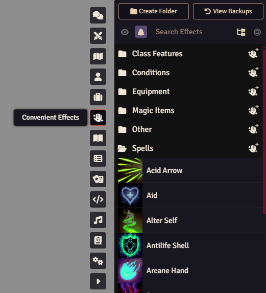

# User Guide

Convenient Effects adds a new button to the token controls.

## Convenient Effects

When the Convenient Effects button is pressed, the Convenient Effects app will open showing multiple collapsed folders. You can expand or collapse any folder and hover over an effect for a brief description of what it does. To apply an effect, select any number of tokens on the canvas and then select the effect you want from the list. This will toggle it on or off for all selected tokens.



You can also click and drag any effect from the Convenient Effects app onto an actor sheet to apply it to that actor. This is useful for when that actor isn't currently on the canvas.

### Nested Convenient Effects

Certain effects have multiple types of effects to choose from when adding or removing them. For instance, Enhance Ability has six different effects to choose from. These nested effects are indicated by a multiple trees icon in the app. When chosen, a dialog is displayed allowing you to choose which of the nested effects to apply.


**Note**: Built-in nested effects are hidden by default. They can be shown as normal in the Convenient Effects app by toggling the Show Nested Effects icon in the app as indicated by the tree.

## Modifying Effects

Convenient Effects allows you to create your own effects using the standard active effect sheet as well as update or delete any existing effects.

### Creating New Folders

New folders can be created by clicking the "Create Folder" button.


### Creating New Effects

New effects can be created by either pressing the "Create Effect" button or by right clicking and existing effect and clicking "Duplicate".


If you choose to create a new effect, you're presented with the active effect config sheet with all the default values. If you choose to duplicate an effect, all values will be filled in with the duplicated effects values.


From here, you can also turn open the Convenient Config to modify additional Convenient Effect configuration options.


### Importing/Exporting Custom Effects

Any effect folders can be imported from a JSON file or exported to a JSON file. This is helpful when you want to transfer effects between worlds.


To export the effects, right-click a folder and click the "Export Data" menu item. This will open a native file handler which allows you to rename the file. Please do not change the file extension from `.json`.

To import custom effects, right-click a folder and click the "Import Data" menu item. This will open a dialog allowing you to choose the file to import. You should navigate to and select the `.json` file that was exported in order to import it. 

**NOTE**: This will **OVERWRITE** the folder with the effects from the JSON. It's recommended that you create a new folder to import into if you do not want this behavior.

### Restoring Backups

In the case that a system has pre-defined effects, the "View Backups" button can be clicked to view any of the initial effects.


You can restore a single effect by clicking and dragging it to the desired folder in the regular app.

You can restore an entire folder of effects by using the import/export behavior as discussed above.

You can completely delete all existing effects and restore all backup effects by clicking the "Reset System Effects" button

## Using Macros

Any effects included or created can be toggled, added, or removed using macros.

### Drag/Drop Macro Creation

To create a macro, click and drag a Convenient Effect from the app to the hotbar. This will create a new macro that will toggle the effect on or off for any selected tokens.

**NOTE**: DND5e creates its own macro as well which might override the hotbar slot. Check the macro directory to find the correct Convenient macro.

### Creating Macros

Convenient Effects includes an API for usage in macros or by other developers. See the [Developer Guide](./developer-guide) for more information.

#### Example for Toggling Effects on Specific Actors

```js
let fromActorId = game.actors.get('some actor id').uuid; // get UUID based on some actor ID (replace it)
let fromTokenId = canvas.tokens.get('some token id').actor.uuid; // get UUID based on some token ID (replace it)
let fromActorName = game.actors.find(actor => actor.data.name == 'Merric (Halfling Barbarian)')?.uuid; // get UUID based on first actor name that matches
game.modules.get("dfreds-convenient-effects").api.toggleEffect({ effectName: 'Bane', uuids: [fromActorId, fromTokenId, fromActorName] });


let actorUuids = canvas.tokens.controlled.map(token => token.actor.uuid); // get multiple uuids from controlled tokens
game.modules.get("dfreds-convenient-effects").api.toggleEffect({ effectName: 'Bane', uuids: actorUuids });
```

Essentially, providing a UUID (unique identifier) to the `toggleEffect` method will apply it only to actors that match that UUID. The macro shows several ways to get that information.

#### Example for Adding Effect

```js
const uuid = canvas.tokens.controlled[0].actor.uuid;
const hasEffectApplied = await game.modules.get("dfreds-convenient-effects").api.hasEffectApplied({ effectName: 'Bane', uuid }); // NOTE that `uuid` is the same as `uuid: uuid`

if (!hasEffectApplied) {
  game.modules.get("dfreds-convenient-effects").api.addEffect({ effectName: 'Bane', uuid });
}
```

This will add the provided effect to the actors that match the UUID.

#### Example for Removing Effect

```js
const uuid = canvas.tokens.controlled[0].actor.uuid;
const hasEffectApplied = await game.modules.get("dfreds-convenient-effects").api.hasEffectApplied({ effectName: 'Bane', uuid });

if (hasEffectApplied) {
  game.modules.get("dfreds-convenient-effects").api.removeEffect({ effectName: 'Bane', uuid });
}
```

This will remove the provided effect from the actors that match the UUID.

#### Example for Customizing Effect

```js
const uuid = canvas.tokens.controlled[0].actor.uuid;
const effectData = game.modules.get("dfreds-convenient-effects").api.findEffect({ effectName: 'Bane' }).toObject();
effectData.name = 'Test';

game.modules.get("dfreds-convenient-effects").api.addEffect({ effectData, uuid });
```

Each effect included in Convenient Effects can be customized before being added. In this example, the Bane effect is copied but renamed to 'Test'.

## Integrating with Midi-QoL

Midi-QoL has graciously added support for auto applying Convenient Effects. For instance, if a player decides to cast Blur on themselves, the Blur effect will automatically be applied to their character. If a barbarian wants to Rage, then Midi will auto apply the Rage condition. 

Midi does this by checking the name of the feature that was used and checking to see if there is a matching Convenient Effect. If there is, it applies it to the targeted token or to the user if it has a target of "Self".

To enable this behavior, you need to enable the "Auto apply item effects to targets" and the "Apply Convenient Effects" settings located in the Midi workflow configuration settings.


## Module Configuration


### App Controls Permission

This setting dictates which roles should be able to access the token control to open the Convenient Effects app. All roles with privilege equal to or higher than the selected role are able to view and use the Convenient Effects app.

This control can be disabled for everyone by setting the selection to 'None'.

### Create Folders Permission

This setting dictates which roles should be able to create new folders in the app. All roles with privilege equal to or higher than the selected role are able to create folders.

This control can be disabled for everyone by setting the selection to 'None'.

**NOTE**: The provided role needs to be able to create items.


## Dependency Modules

### SocketLib

[SocketLib](https://foundryvtt.com/packages/socketlib) allows convenient effects to be executed as if they were applied by a GM, even if a player is the one that triggers them.

#### Why have this dependency?

If you allow your players to view the convenient effects app via the settings and they set their personal settings to Prioritize Targets, they can now actually apply effects to any linked or PC actors they're targeting.

This also fixes the integration with Midi QoL (see section) so that any matching effects can be applied to linked tokens such as named NPCs or other player characters when they target them and cast spells/use features.

### LibWrapper

[LibWrapper](https://foundryvtt.com/packages/lib-wrapper/) allows for wrapping core Foundry functions. It's used by dozens of modules, so there is a chance you already have it.

#### Why have this dependency?

LibWrapper provides an easy way to wrap Foundry methods while minimizing the chances of two modules conflicting with each other. While this is not _technically_ a hard dependency, you will get a popup explaining that a fallback is being used (included with this module). You should enable libWrapper to remove this popup.

### Lib: DFreds UI Extender

[Lib: DFreds UI Extender](https://foundryvtt.com/packages/lib-dfreds-ui-extender) is a library that makes it easy to add new UI elements to Foundry.

#### Why have this dependency?

Lib: DFreds UI Extender provides an easy way to add new buttons to the scene controls. In this case, Convenient Effects adds a button to the token controls on the left.

## Helpful Modules

None of the modules listed in this section are required for Convenient Effects to work. However, they do improve the usage of various effects immensely.

### Times Up

[Times Up](https://foundryvtt.com/packages/times-up) handles automatic expiration of effects that have durations. A lot of the included effects in Convenient Effects have durations set, so this will allow them to be expired at the right time.

If you choose not to install this, effects will never expire and have to be removed manually.

### DAE

[DAE](https://foundryvtt.com/packages/dae) handles various additional expiration effects, such as after one attack or after one hit. It also adds ability to reference actor data in effect value definitions (i.e. @abilities.dex.mod), adds an extended set of custom fields like all of the traits, and the ability to update derived fields, such as abilities.dex.mod.

If you don't use this module, some included effects will only partially work.

### Midi-QoL

[Midi-Qol](https://foundryvtt.com/packages/midi-qol) handles a vast amount of automation for various active effects. Specifically, it allows for granting auto advantage/disadvantage to effects as well as displaying prompts for optional uses of effects (like using your bardic inspiration on a saving throw).

Midi-QoL has also explicitly integrated with Convenient Effects to allow users to auto apply the active effects from Convenient Effects when appropriate. See [Integrating with Midi-QoL](https://github.com/DFreds/dfreds-convenient-effects/wiki/User-Guide#integrating-with-midi-qol) for more information.

### Active Token Effects

[Active Token Effects](https://foundryvtt.com/packages/ATL) (or ATE) allows active effects to also manipulate dim/bright vision for a token, dim/bright light emitted by a token, or the size of a token. Certain effects (like Torch) will use ATE to change the vision or lighting on whoever it affects. 

### Token Magic FX

[Token Magic FX](https://foundryvtt.com/packages/tokenmagic) allows for active effects to add visual FX to tokens via active effects. For example, the Blur spell can actually make the token look blurred.

This requires enabling [DAE](#dae) as it uses the `macro.tokenMagic` active effect added by it.