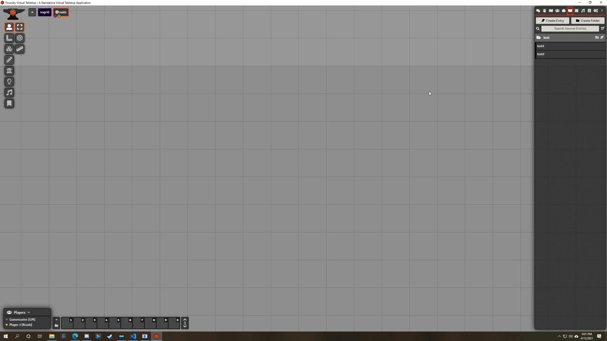
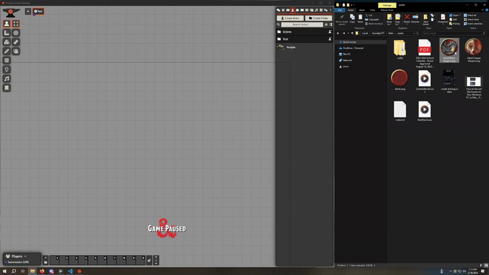
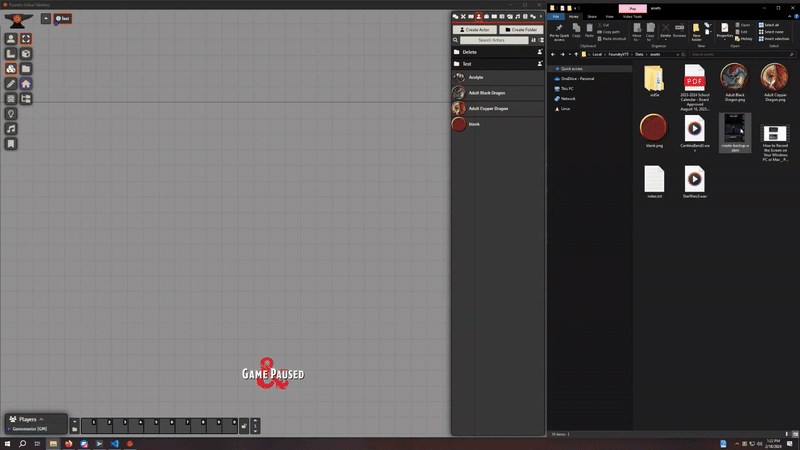
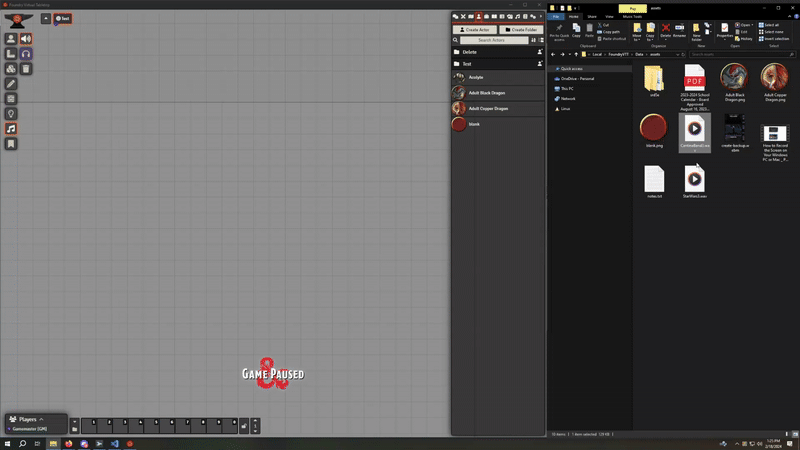
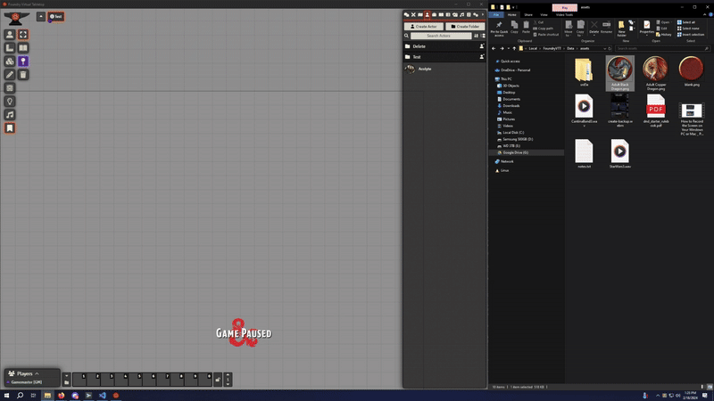

# DFreds Droppables

 

 
 

A module which allows you to drag and drop an entire folder of tokens or journal entries onto the canvas as well as uploading files for tokens, tiles, sounds, or notes.

## Let Me Sell You This

Have you ever needed to drop all of your pesky players onto a scene at once? Have you ever _dreaded_ the thought of dragging them all out onto the map one by one like some kind of peasant? What about needing to upload a bunch of cool images for all sorts of awesome characters? Well, now you don't have to. Yay mild conveniences.

## What This Module Does

### Droppable Actor and Journal Folders on the Canvas

On the drag and drop of an actor folder or journal entries folder onto the canvas, Droppables creates tokens (for actors) or notes (for journal entries) for each item in that folder. Note that it will not do anything for any sub-folders, as that could get sort of insane.

### Droppable Files on the Canvas

On the drag and drop of one or many files onto the canvas, Droppables creates either a token, tile, ambient audio, or journal entry depending on the currently selected layer for each file.

Here's how it works:

#### Token Layer

A new actor is created of a chosen type with the actor image and token image set to the dropped image.

Supported Files: Images

#### Tiles Layer

A new tile is created using the dropped image or video.

Supported Files: Images and videos

#### Sounds Layer

A new ambient audio is created using the dropped audio.

Supported Files: Audio (duh)

#### Notes Layer

A single journal is created with journal entries corresponding to each of the files dropped. In the case of a text file, it will copy all the text to the new journal entry.

Supported Files: Images, videos, PDFs, and text files

## Required Modules

- [libWrapper](https://foundryvtt.com/packages/lib-wrapper) by ruipin - A
  library that wraps core Foundry methods to make it easier for module
  developers to add functionality. Note that if you for some reason don't want
  to install this, a shim will be used instead.