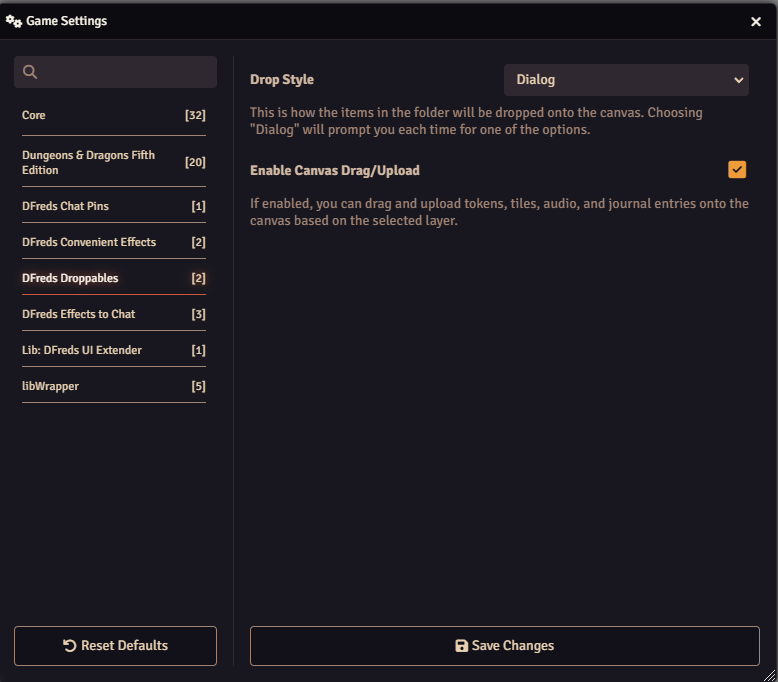

# Droppables

 

 
 

A module which allows you to drag and drop an entire folder of tokens or journal entries onto the canvas as well as uploading files for tokens, tiles, sounds, or notes.

## Overview

Droppables streamlines the process of adding content to your Foundry VTT scenes
by enabling powerful drag-and-drop functionality. Instead of placing tokens and
assets one by one, you can now drop entire folders of actors or journal entries
onto your canvas in a single action. The module automatically creates and
positions tokens or notes for each item in the folder, saving valuable
preparation time.

Additionally, Droppables revolutionizes how you import external files into
Foundry. Simply drag files directly onto your canvas, and based on the currently
selected layer, the module will automatically create the appropriate game
elements - whether that's new actors with tokens, tiles, ambient sounds, or
journal entries. This eliminates the traditional multi-step process of uploading
files and then creating game elements separately.

## Features

- Easily drop entire folders of actors onto the canvas in a stack, line, or randomly
- Easily drop folders of notes onto the canvas
- Drop various files onto the canvas to automatically upload them to your world
and create tokens, tiles, sounds, or notes

## Configuration

Settings are provided to configure the module.

## Examples

### Folder Dropping

### File Dropping on Token Layer

### File Dropping on Tiles Layer  

### File Dropping on Sounds Layer

### File Dropping on Notes Layer

## Required Modules

- [libWrapper](https://foundryvtt.com/packages/lib-wrapper) by ruipin - A
  library that wraps core Foundry methods to make it easier for module
  developers to add functionality. Note that if you for some reason don't want
  to install this, a shim will be used instead.