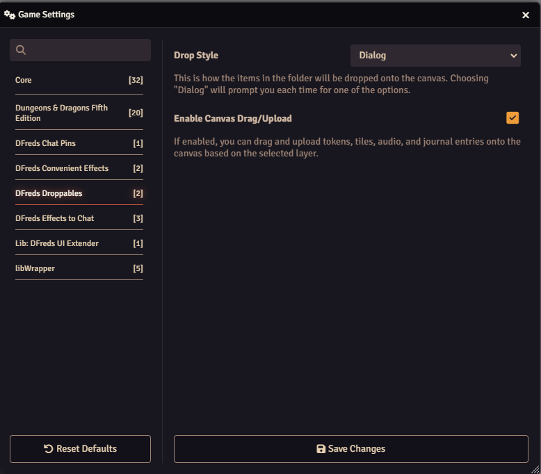
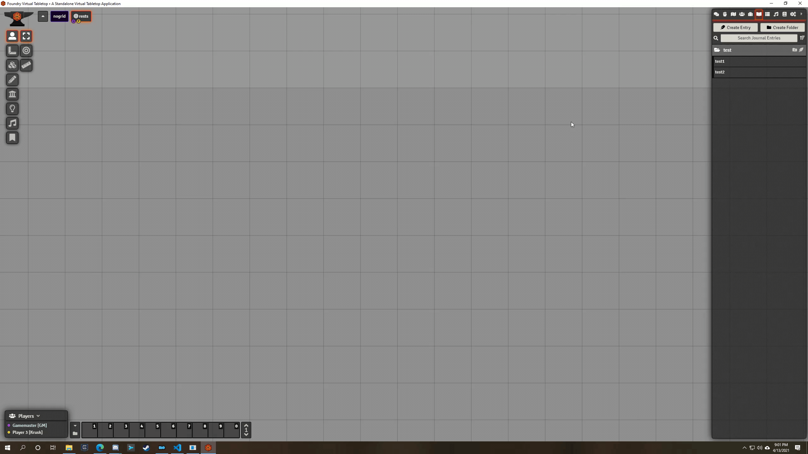
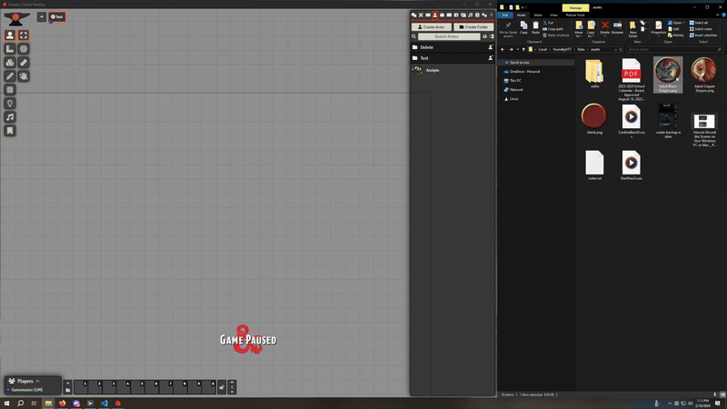
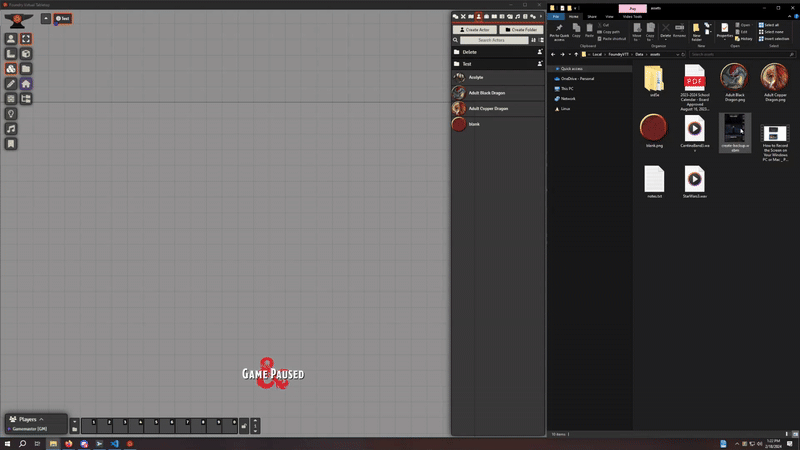
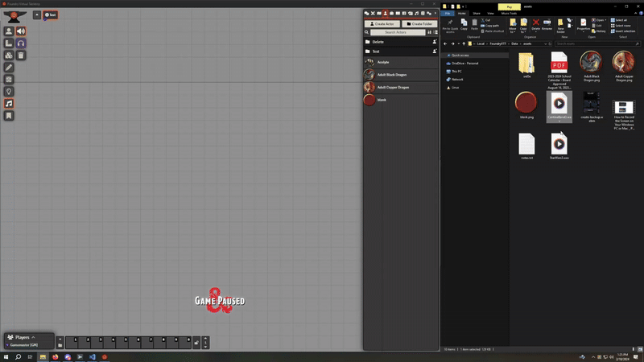
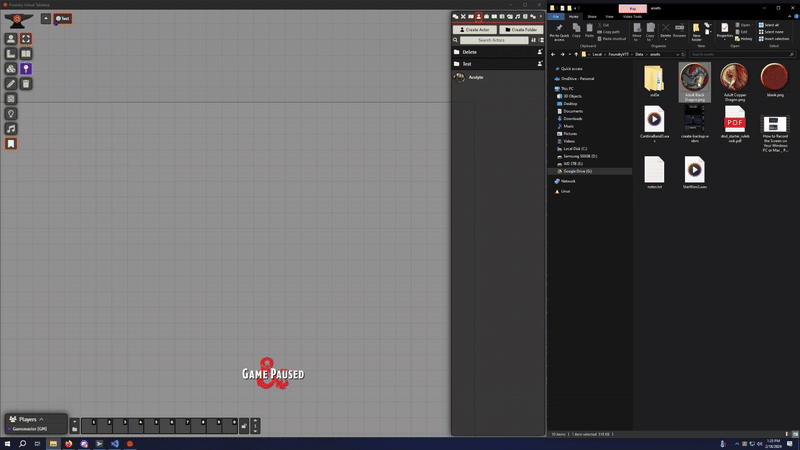
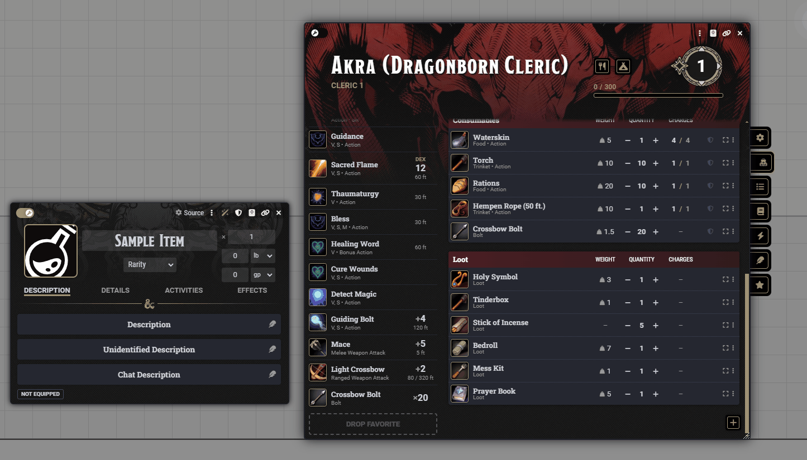

# Droppables

 

 
 

A module which allows you to drag and drop an entire folder of tokens or journal entries onto the canvas, upload files for tokens, tiles, sounds, or notes, and drop files directly onto sidebar directories to instantly create the matching documents.

## Overview

Droppables adds powerful drag-and-drop shortcuts to Foundry VTT. Drop entire
folders of actors or journal entries onto the canvas at once, drop files onto the
canvas to create tokens, tiles, sounds, or notes based on the active layer, or
drop files onto a sidebar directory to instantly create the matching document -
including importing exported `.json` files.

## Features

- Easily drop entire folders of actors onto the canvas in a stack, line, or randomly
- Easily drop folders of notes onto the canvas
- Drop a file onto the canvas to upload it and automatically create a document based on the active layer:
  - **Token layer** - dropped images as new actors and tokens, prompting for the subtype
  - **Tile layer** - dropped images or videos as tiles
  - **Sound layer** - dropped audio files as ambient sounds
  - **Notes layer** - dropped images, PDFs, videos, or text files as a journal entry pinned to the canvas
- Drop images directly from browsers to automatically set the images for tokens, tiles, or notes
- Drag and drop documents directly from their sheet onto any supported area
- Drop a file onto a sidebar directory to upload it and automatically create a document of that type with the file assigned:
  - **Actors** and **Items** - dropped images, prompting for the subtype
  - **Scenes** - dropped images as the scene background
  - **Journal** - dropped images, PDFs, videos, or text files as journal entry pages
  - **Playlists** - dropped audio files as playlist sounds
  - **Roll Tables**, **Cards**, and **Macros** - dropped images
- Drop an exported `.json` file onto its sidebar directory to import it as a new document

## Configuration

Settings are provided to configure the module.

## Examples

### Folder Dropping

### File Dropping on Token Layer

### File Dropping on Tiles Layer  

### File Dropping on Sounds Layer

### File Dropping on Notes Layer

### Drag/Drop Document Link

## Required Modules

- [libWrapper](https://foundryvtt.com/packages/lib-wrapper) by ruipin - A
  library that wraps core Foundry methods to make it easier for module
  developers to add functionality. Note that if you for some reason don't want
  to install this, a shim will be used instead.
