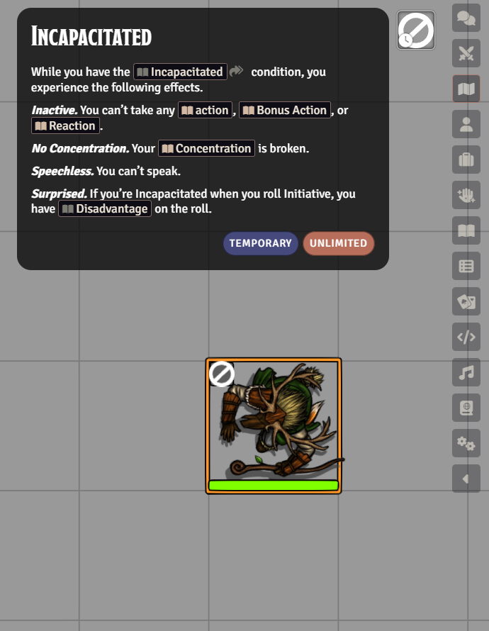

# Effects Panel

 

 
 

A FoundryVTT module that adds a panel of active effects for the selected token.

## Overview

The Effects Panel shows the active effects on the selected token in the top-right
corner of the canvas, so you do not have to open a character sheet to see or
manage them. Click an effect for its description, remaining duration, and
expiration status, then click again to close it - only one is shown at a time.
Double-click opens its configuration, and right-click enables, disables, or
deletes it depending on your settings.

## Features

- View all effects (active, disabled, and passive) on your selected token in a
  convenient panel
- Click an effect to see its name, description, and remaining duration, and
  click again to dismiss it
- Double-click any effect to quickly access its configuration
- Customize right-click behavior to enable, disable, or delete effects with a
  single click
- Configure visibility settings for different effect types and adjust panel
  behavior to match your preferences
- Pick individual effects to always show or always hide, so you can surface a
  couple of important passives without turning on every passive. These choices
  are per player, override the visibility settings, and are managed from the
  toggle at the top of the panel

## Showing and Hiding Individual Effects

The toggle button (sliders icon) at the top of the panel enters **manage mode**,
where every effect is shown with an eye badge. Click an effect's icon to flip
whether it shows (open eye) or hides (crossed-out eye). Click the toggle again to
exit; right-click it to clear all choices.

Choices are per player, keyed by effect name, and override the visibility
settings - so you can leave **Show Passive Effects** off and still pin a passive
to show, or hide one noisy effect without disabling its category.

## Settings

| Setting                                          | Scope  | Default  | Description                                                                       |
| ------------------------------------------------ | ------ | -------- | --------------------------------------------------------------------------------- |
| **Show Disabled Effects**                        | Client | Enabled  | Show disabled effects in the panel with a grey tint.                              |
| **Show Passive Effects**                         | Client | Disabled | Show passive effects in the panel.                                                |
| **Show Duration Overlays**                       | Client | Enabled  | Show an overlay icon over each effect indicating its duration.                    |
| **Allow Right-Clicking on Item Effects**         | Client | Disabled | Allow the right-click behavior to run on effects provided by items.               |
| **Icon Size**                                    | Client | 42       | The size of the icons in the panel, from 16 to 100.                               |
| **Passive Effects Right-Click Behavior**         | Client | Disable  | What right-clicking a passive effect does.                                        |
| **Temporary Effects Right-Click Behavior**       | Client | Dialog   | What right-clicking a temporary effect does.                                      |
| **Passive Effects Shift Right-Click Behavior**   | Client | Disable  | What shift right-clicking a passive effect does.                                  |
| **Temporary Effects Shift Right-Click Behavior** | Client | Delete   | What shift right-clicking a temporary effect does.                                |
| **Allow Right-Click**                            | World  | Player   | The minimum role required to run the right-click behavior on an effect.           |
| **View Permission**                              | World  | Player   | The minimum role required to see the effects panel at all.                        |
| **View Details Permission**                      | World  | Player   | The minimum role required to see effect details such as duration and description. |

The four right-click behaviors each accept **Dialog** (prompt for what to do),
**Delete**, or **Disable**. The three permissions each accept Player, Trusted
Player, Assistant GM, Game Master, or None, where **None** disables that
capability for everyone.

:::tip
Per-effect show/hide choices (see [Showing and Hiding Individual
Effects](#showing-and-hiding-individual-effects)) take precedence over **Show
Passive Effects** and **Show Disabled Effects**.
:::

## Required Modules

- [libWrapper](https://foundryvtt.com/packages/lib-wrapper) by ruipin - A
  library that wraps core Foundry methods to make it easier for module
  developers to add functionality. Note that if you for some reason don't want
  to install this, a shim will be used instead.

## Helpful Modules

While not strictly required, the functionalities provided by these modules
drastically improve the usage of the features in this module.

- [DFreds Convenient Effects](https://foundryvtt.com/packages/dfreds-convenient-effects) by DFreds -
Includes a ton of pre-configured effects for the DnD 5e system. It also adds a
description box to the active effect config sheet which will be displayed on the
effects panel.
- [Times Up](https://foundryvtt.com/packages/times-up) by tim posney - Deletes
effects when their time is up or after a certain number of rounds or turns
