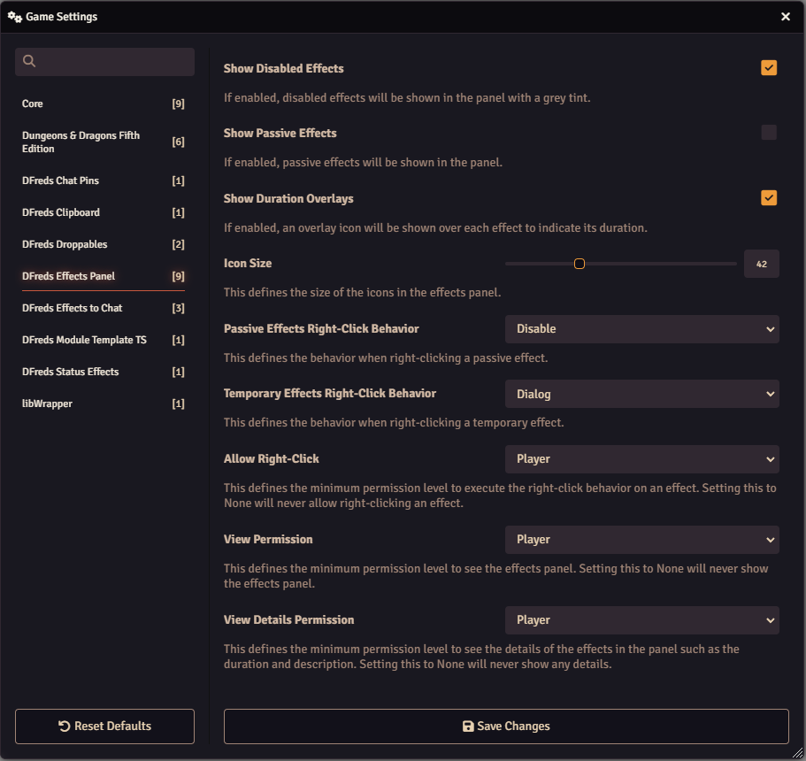

# Effects Panel

 

 
 

A module that adds a panel of active effects for the selected token.

## Overview

Managing active effects in Foundry VTT often requires opening character sheets
and navigating through menus, which can disrupt gameplay flow. The Effects Panel
streamlines this process by providing quick access to effect management directly
from the canvas.

When you select a token, a convenient panel appears in the top-right corner
displaying all active effects on that actor. This panel allows you to view
effect details, remaining durations, expiration status, and descriptions by
hovering over the icons. 

The panel offers intuitive controls for effect management - double-click an
effect to open its configuration, and right-click to quickly enable, disable, or
delete effects based on your preferred settings. This streamlined interface
eliminates the need to constantly open character sheets, keeping your focus on
the game rather than the interface.

## Features

- View all effects (active, disabled, and passive) on your selected token in a
convenient panel
 - Hover over effects to see their name, description, and
remaining duration
 - Double-click any effect to quickly access its
configuration
 - Customize right-click behavior to enable, disable, or delete
effects with a single click
 - Configure visibility settings for different
effect types and adjust panel behavior to match your preferences

## Configuration

Settings are provided to configure the module.

## Required Modules

- [libWrapper](https://foundryvtt.com/packages/lib-wrapper) by ruipin - A
  library that wraps core Foundry methods to make it easier for module
  developers to add functionality. Note that if you for some reason don't want
  to install this, a shim will be used instead.

## Helpful Modules

While not strictly required, the functionalities provided by these modules
drastically improve the usage of the features in this module.

- [DFreds Convenient Effects](https://foundryvtt.com/packages/dfreds-convenient-effects) by DFreds -
Includes a ton of pre-configured effects for the DnD 5e system. It also adds a
description box to the active effect config sheet which will be displayed on the
effects panel.
- [Times Up](https://foundryvtt.com/packages/times-up) by tim posney - Deletes
effects when their time is up or after a certain number of rounds or turns
