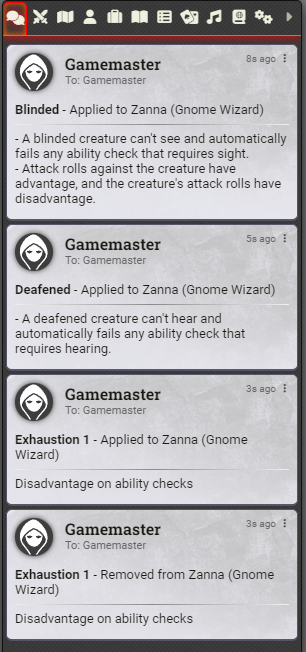
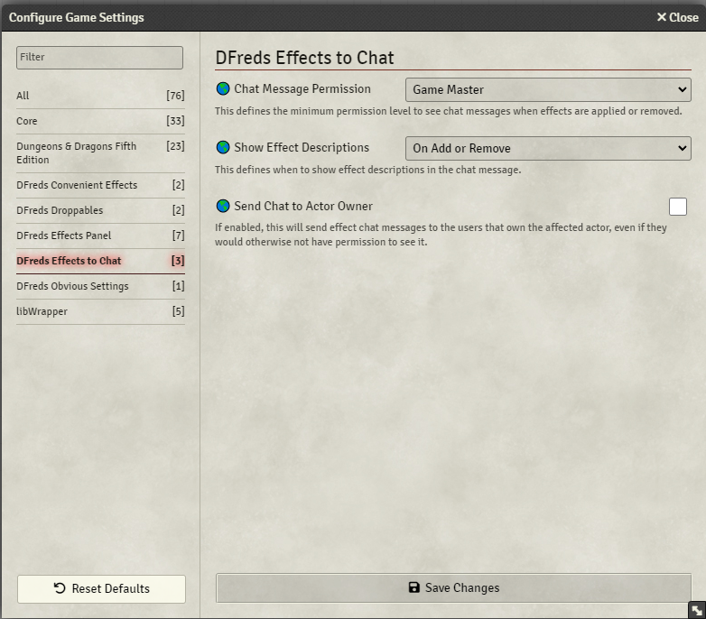

# DFreds Effects to Chat

A FoundryVTT module that sends added and removed effects to the chat.

Foundry page: https://foundryvtt.com/packages/dfreds-effects-to-chat

## Let Me Sell You This

Do you want a log of added and removed effects from your players and monsters?
Do you want to know what an effect does without having to dig into the effect on
the actor sheet?  Do you want to make sure none of your pesky players are
removing effects prematurely? Well! Now you can make sure they ain't cheatin'.

## What This Module Does

This module creates a chat message whenever an effect is added or removed from
an actor.

You can configure some stuff:

