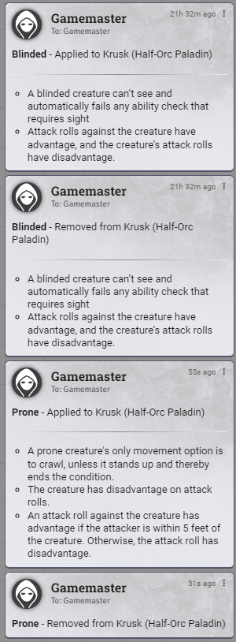
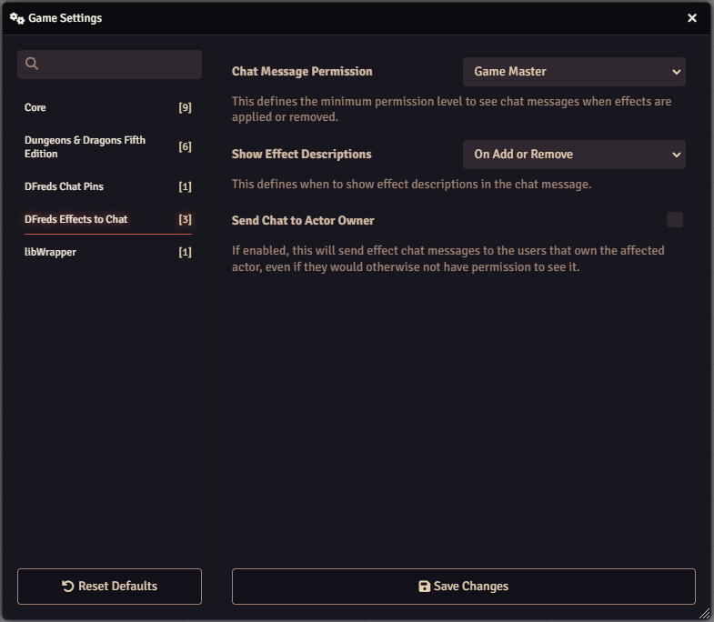

# Effects to Chat

 

 
 

A FoundryVTT module that sends added and removed effects to the chat.

## Overview

Effects to Chat enhances Foundry VTT's effect management by providing a detailed
log of all effects as they are added and removed from actors. This allows Game
Masters and players to easily track effect changes and view effect descriptions
directly in the chat, eliminating the need to dig through actor sheets.

The module automatically generates chat messages whenever an effect is added,
removed, or expires from any actor, providing transparency and accountability in
effect management while helping Game Masters ensure effects are being handled
appropriately during gameplay.

## Features

- Sends chat messages when an effect is added, removed, or expires
- Configure if the effect description should be shown or not

## Configuration

Settings are provided to configure the module.

