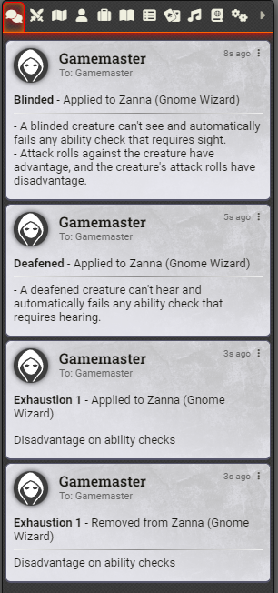

# Effects to Chat

 

 
 

A FoundryVTT module that sends added and removed effects to the chat.

## Overview

Effects to Chat posts a chat message whenever an effect is added to, removed
from, or expires on an actor, so effect changes are visible without digging
through actor sheets. Messages can include the effect's description, and who
sees them is controlled by role.

## Features

- Sends chat messages when an effect is added, removed, or expires
- Configure if the effect description should be shown or not
- Control the minimum role that can see the messages
- Optionally send the messages to the owners of the affected actor, regardless of role

## Settings

Every setting is world-scoped, so only a Game Master can change them and they
apply to everyone.

| Setting                     | Default          | Description                                                                                            |
| --------------------------- | ---------------- | ------------------------------------------------------------------------------------------------------ |
| **Chat Message Permission** | Game Master      | The minimum role required to see chat messages when effects are applied or removed.                    |
| **Show Effect Descriptions**| On Add or Remove | When to include the effect's description in the chat message.                                          |
| **Send Chat to Actor Owner**| Disabled         | Send effect messages to the users who own the affected actor, even if their role would otherwise hide them. |

**Chat Message Permission** accepts Player, Trusted Player, Assistant GM, or
Game Master.

**Show Effect Descriptions** accepts:

- **On Add or Remove** - include the description in every message
- **On Add Only** - include it when an effect is applied, but not when removed
- **Never** - omit it entirely
