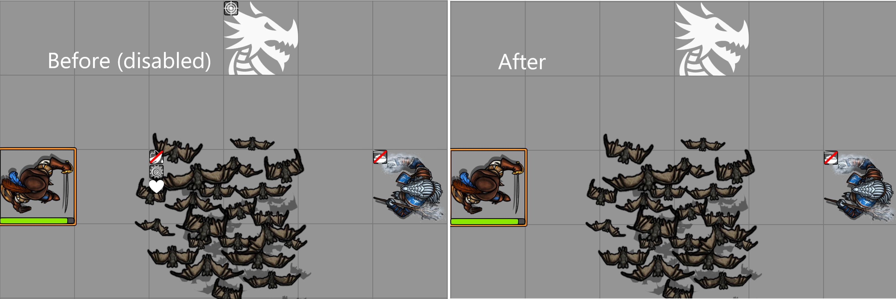
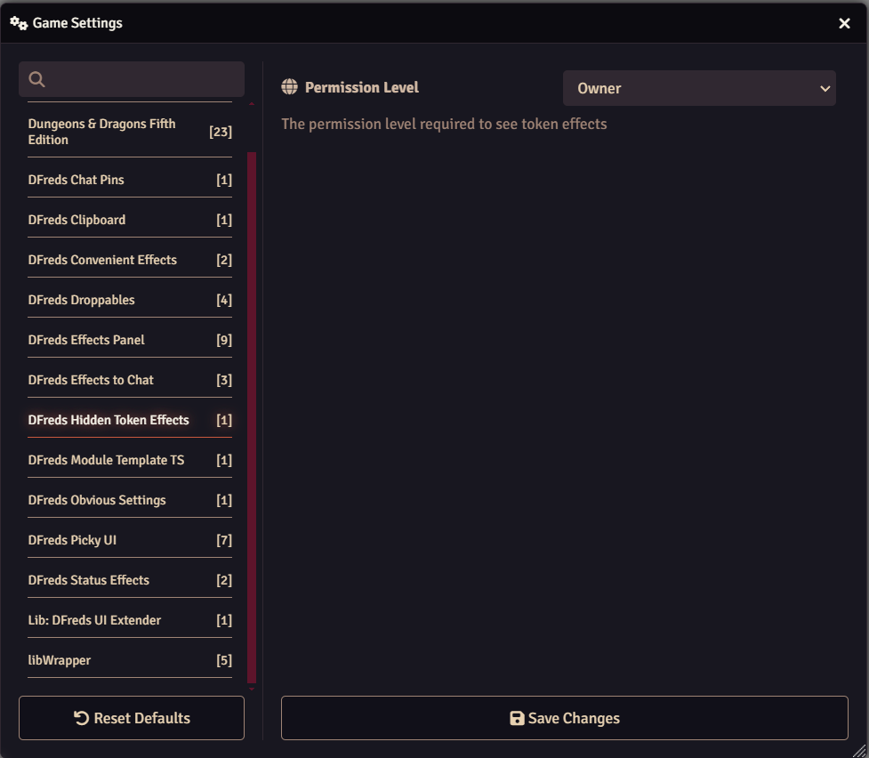

# Hidden Token Effects 

 

 
 

A FoundryVTT module that hides effect icons on tokens.

## Overview

Hidden Token Effects offers control over what effects appear to your players on other tokens.

## Features

- Automatically hides any effect icons that do originate from an actor or item
the user owns 
- Easily configure when icons appear based on the level of
ownership (limited, observer, owner)
- Overlay icons always appear

## Configuration

Settings are provided to configure the module.

## Required Modules

- [libWrapper](https://foundryvtt.com/packages/lib-wrapper) by ruipin - A
  library that wraps core Foundry methods to make it easier for module
  developers to add functionality. Note that if you for some reason don't want
  to install this, a shim will be used instead.