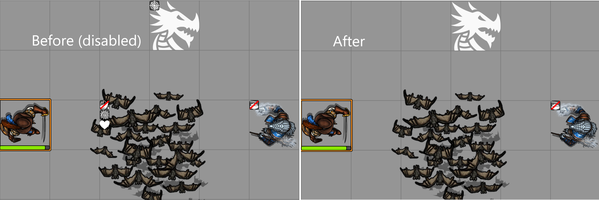

# Hidden Token Effects 

 

 
 

A FoundryVTT module that hides effect icons on tokens.

## Overview

Hidden Token Effects offers control over what effects appear to your players on other tokens.

## Features

- Automatically hides any effect icons that do not originate from an actor or
item the user owns
- Easily configure when icons appear based on the level of ownership (limited,
observer, owner)
- Overlay icons always appear

## Settings

| Setting              | Default | Description                                                |
| -------------------- | ------- | ---------------------------------------------------------- |
| **Permission Level** | Owner   | The ownership level a user needs to see a token's effects. |

**Permission Level** accepts:

- **Disabled** - turn the hiding off, so every effect icon is visible to everyone
- **None** - no ownership required, so every effect icon is visible
- **Limited** - limited ownership or higher
- **Observer** - observer ownership or higher
- **Owner** - only users who own the effect's actor or item

:::info
This is a world setting, so only a Game Master can change it and it applies to
everyone. Changing it redraws the effects on every token immediately, with no
reload required.
:::

:::note
Overlay effects are exempt from this setting and are always drawn, whatever the
permission level.
:::

## Required Modules

- [libWrapper](https://foundryvtt.com/packages/lib-wrapper) by ruipin - A
  library that wraps core Foundry methods to make it easier for module
  developers to add functionality. Note that if you for some reason don't want
  to install this, a shim will be used instead.