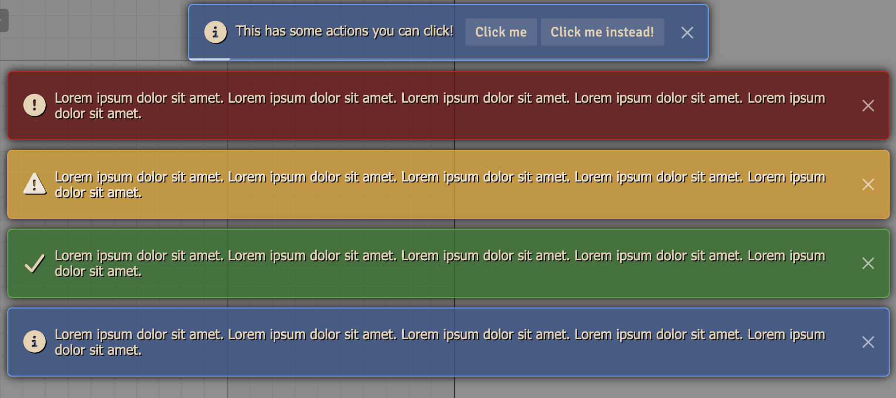
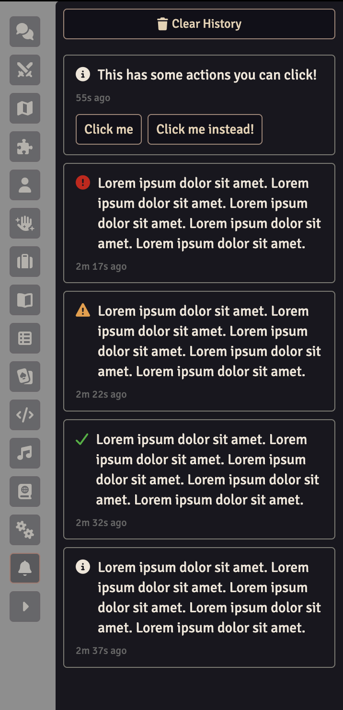

# Notifications


<a target="_blank" href="https://foundryvtt.com/packages/dfreds-notifications"></a>
<br />
<a target="_blank" href="https://github.com/DFreds/dfreds-notifications"></a>

<br/>
<br/>

A module that replaces and expands on the default notifications.

## Overview

Foundry's notifications are useful, but they are also fleeting. If you tab away
for a moment, whatever appeared while you were gone is simply gone too. And
because a notification is only ever a line of text, a module that wants to tell
you something actionable has no way to let you act on it.

Notifications replaces the default notification system entirely. Every
notification raised by Foundry or by any other module is rendered by this
module automatically, with no changes needed on their part. On top of that, it
adds two things the core system has no concept of: **action buttons** that let a
notification do something when clicked, and a **history** of everything shown
this session, kept in a sidebar directory so you can catch up on whatever you
missed.

<!-- TODO screenshot: a notification with action buttons -->
## Features

- Replaces the default notifications, so everything from Foundry and other modules is rendered by this module automatically
- Adds a notification history sidebar directory, so you can catch up on anything you missed while looking away
- Adds developer-defined action buttons to notifications, which remain usable from the history
- Supports everything the default notifications do, including permanent, progress, and localized messages





## Quick Start

There is nothing you have to configure. Once the module is enabled, all
notifications are handled by it. Everything under [Settings](#settings) is
optional.

To see what you missed, open the notification history from the bell icon on the
sidebar. Each entry shows the message and how long ago it appeared, and hovering
the time shows the exact timestamp. If a notification had action buttons, those
buttons still work from the history.

When a notification arrives while the history is not visible, an orange dot
appears on the bell icon. Unlike the chat notification dot, it does not fade on
its own. It stays until you actually open the tab, since the whole point is
catching up on something you missed.

<!-- TODO screenshot: the notification history sidebar directory -->

:::info
The history is per-player and lasts for the current session only. Reloading your
browser clears it. It holds the most recent 200 notifications.
:::

## Settings

Every setting is client-scoped, so each player configures their own and nothing
you change affects anyone else at the table.

| Setting                    | Default           | Description                                                                                       |
| -------------------------- | ----------------- | ------------------------------------------------------------------------------------------------- |
| **Notification Position**  | Top Center        | Where notifications appear on screen. Nine positions are available, from top left to bottom right. |
| **Maximum Notifications**  | 5                 | How many notifications can be shown at once, from 1 to 10.                                        |
| **Notification Duration**  | 5 seconds         | How long a notification stays on screen before dismissing itself, from 1 to 30 seconds.           |
| **Unread Indicator**       | All Notifications | Which notifications put a dot on the sidebar tab when the history is not visible.                 |

Each position is offset so notifications stay clear of the sidebar, scene
controls, and hotbar.

**Unread Indicator** accepts:

- **All Notifications** - any notification lights the dot
- **Warnings and Errors** - informational and success notifications are ignored
- **Errors Only** - only errors light the dot
- **Never** - the dot is disabled entirely

:::info
Raising **Maximum Notifications** only affects what is on screen. Anything beyond
the limit is queued and shown as earlier notifications dismiss, but it still
enters the history immediately, so nothing is ever missed because of the queue.
:::

:::tip
**Notification Duration** does not apply to permanent or progress notifications.
Those stay until they are dismissed or complete.
:::

## API

The module exposes an API for developers and macro writers.

```js
const { notifications } = game.modules.get("dfreds-notifications").api;
```

### Displaying Notifications

The API mirrors the core notification methods, so anything valid for
`ui.notifications` is valid here.

```js
notifications.info("An informational message");
notifications.warn("A warning message");
notifications.error("An error message");
notifications.success("A success message");

// Or specify the type directly
notifications.notify("An informational message", "info");
```

:::tip
You do not have to use the API to raise a notification. Calling
`ui.notifications.info("Hello")` works exactly the same, because this module
replaces the core notifier. The API mainly exists to give Typescript projects
the correct types for the added options.
:::

### Action Buttons

Pass `actions` to add buttons to a notification. Each button runs its callback
when clicked, and dismisses the notification unless told otherwise.

<!-- TODO screenshot: a notification with two action buttons -->

```js
notifications.warn("Your token was moved off the grid", {
  actions: [
    {
      label: "Jump to it",
      icon: "fa-solid fa-location-crosshairs",
      callback: () => canvas.tokens.get(tokenId)?.control(),
    },
    {
      label: "Remind me later",
      dismissOnClick: false,
      callback: () => console.log("Still showing"),
    },
  ],
});
```

Each action supports the following:

| Property         | Type       | Description                                                            |
| ---------------- | ---------- | ---------------------------------------------------------------------- |
| `label`          | `string`   | The button label. Localize it before passing it in.                    |
| `icon`           | `string`   | Optional Font Awesome icon class shown before the label.               |
| `callback`       | `function` | Called with the toast element and the notification when clicked.       |
| `dismissOnClick` | `boolean`  | Whether clicking dismisses the notification. Defaults to `true`.       |

:::info
Actions are held in memory, which is what allows them to keep working from the
history. They are not saved anywhere and do not carry across a reload or to
other players.
:::

### Notification Options

All of the core notification options are supported.

| Option      | Type      | Description                                                      |
| ----------- | --------- | ---------------------------------------------------------------- |
| `permanent` | `boolean` | Display until dismissed rather than timing out.                  |
| `progress`  | `boolean` | Display a progress bar that can be updated.                      |
| `localize`  | `boolean` | Treat the message as a localization key.                         |
| `format`    | `object`  | Values to interpolate into the localized message.                |
| `console`   | `boolean` | Whether to also log to the console. Defaults to `true`.          |
| `escape`    | `boolean` | Whether to escape the values of `format`. Defaults to `true`.    |
| `clean`     | `boolean` | Whether to clean the message as untrusted input. Defaults to `true`. |

### Progress Notifications

A progress notification stays on screen and can be updated as work completes. It
dismisses itself shortly after reaching 100%.

```js
const progress = notifications.info("Importing data", { progress: true });

progress.update({ pct: 0.5, message: "Halfway there" });
progress.update({ pct: 1, message: "Done!" });
```

### Managing Notifications

```js
const notification = notifications.info("Working", { permanent: true });

notifications.has(notification); // Whether it is still queued or displayed
notifications.remove(notification); // Dismiss it
notifications.clear(); // Dismiss everything currently shown
```

### Reading the History

```js
const api = game.modules.get("dfreds-notifications").api;

api.history; // Everything shown this session, oldest first
api.clearHistory(); // Empty the history
```

Each history entry contains the `id`, `type`, `message`, and `timestamp` of the
notification, along with any `actions` it was given.

## Required Modules

- [Lib: DFreds UI Extender](https://foundryvtt.com/packages/lib-dfreds-ui-extender) by DFreds - A library that makes it easy to add new UI elements to Foundry
- [libWrapper](https://foundryvtt.com/packages/lib-wrapper) by ruipin - A
  library that wraps core Foundry methods to make it easier for module
  developers to add functionality. Note that if you for some reason don't want
  to install this, a shim will be used instead.
