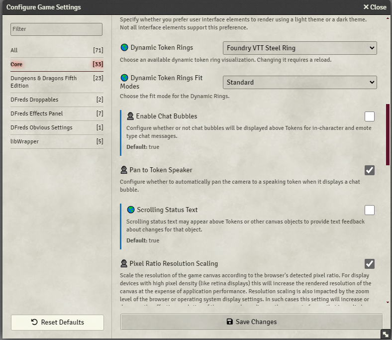
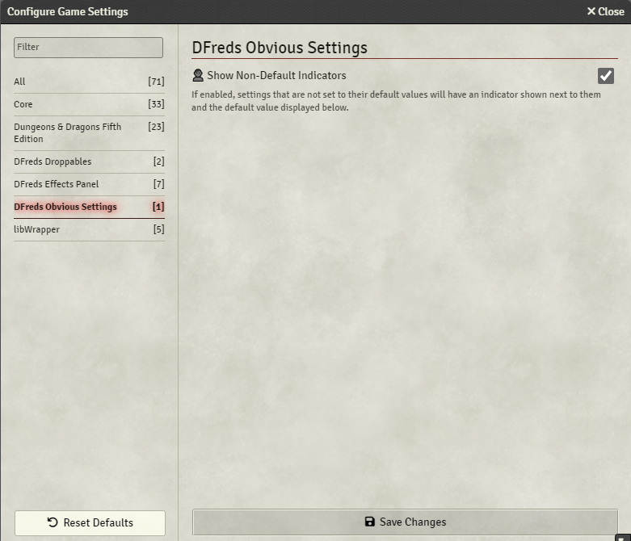

# DFreds Obvious Settings

A FoundryVTT module that makes the settings configuration more obvious in various ways.

Foundry page: https://foundryvtt.com/packages/dfreds-obvious-settings

    
Metadata

    
    
    
     
     
    
    
     
    
    

## Let Me Sell You This

When setting up your new game, isn't it a bit confusing which settings will
impact players, and which settings will only impact yourself? Do you forget what
settings are different from their default values? Well, if only there was a
module to help you out...

## What This Module Does

This module adds a 🌎 icon before settings scoped to "world" (will be set for
all players) and a 👤 icon before settings scoped to "client" (personal settings
per user).

It also indicates if a setting is not set to its default value.

You can configure some stuff:

