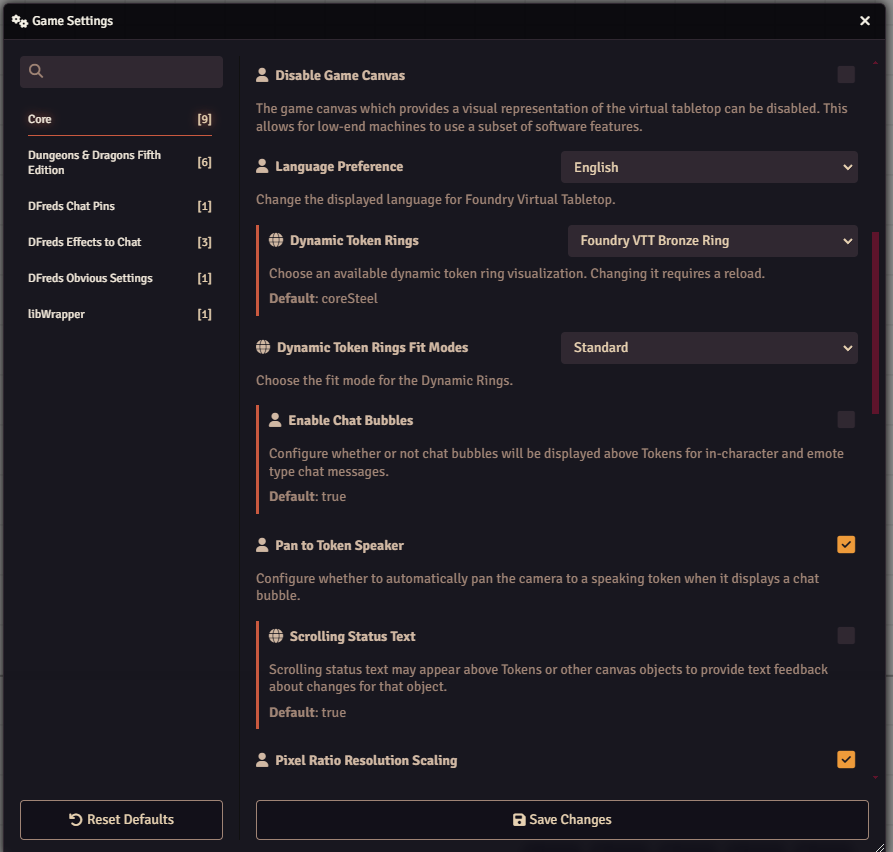
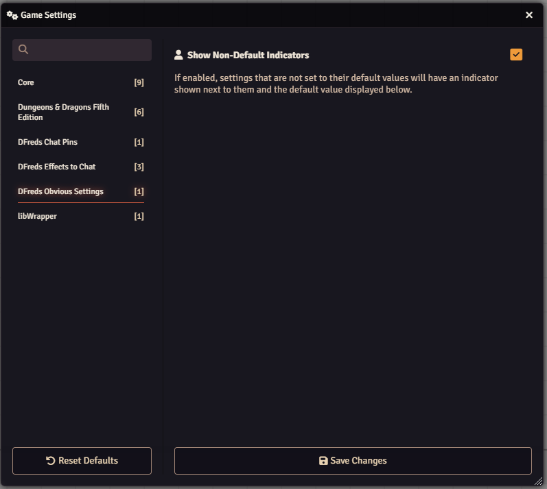

# Obvious Settings

 

 
 

A FoundryVTT module that makes the settings configuration more obvious in various ways.

## Overview

Obvious Settings enhances Foundry VTT's settings interface by providing clear
visual indicators that help users understand the scope and state of each
configuration option. When managing settings across a game, it can be
challenging to distinguish between settings that affect all players versus those
that only impact individual users. This module addresses that confusion by
adding intuitive icons that instantly communicate a setting's scope.

The module places a globe icon before "world" settings that apply globally to all
players, and a user icon before "client" settings that are personal to each user.
Additionally, it provides visual indicators when settings have been modified
from their default values, making it easy to track which configurations have
been customized.

## Features

- Displays what settings are client based or world based
- Shows when a setting is not set to its default value

## Configuration

Settings are provided to configure the module.

