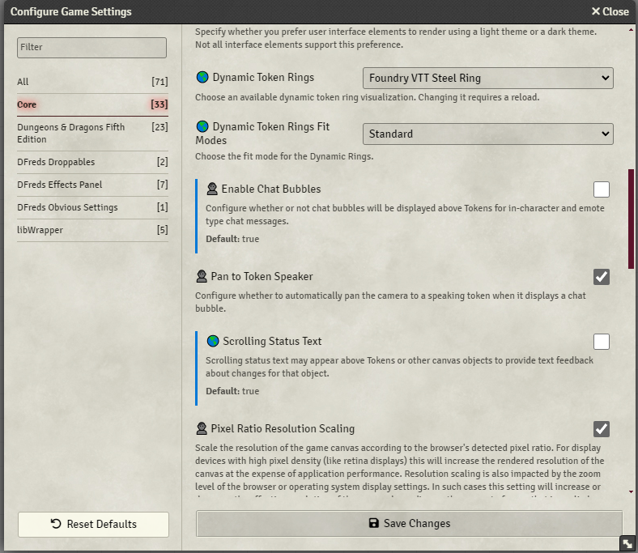

# Obvious Settings

 

 
 

A FoundryVTT module that makes the settings configuration more obvious in various ways.

## Overview

Obvious Settings marks up Foundry's settings interface so each option's scope is
clear at a glance: a globe icon for world settings that apply to everyone, and a
user icon for client settings that are personal to each player. It also flags
any setting that is no longer at its default and shows what that default was.

## Features

- Displays what settings are client based or world based
- Shows when a setting is not set to its default value

## Settings

| Setting                         | Scope  | Default | Description                                                                                                     |
| ------------------------------- | ------ | ------- | --------------------------------------------------------------------------------------------------------------- |
| **Show Non-Default Indicators** | Client | Enabled | Mark settings that are not set to their default value with an indicator, and show the default value below them. |

:::info
The world/client scope icons described above are always shown and are not
configurable.
:::
