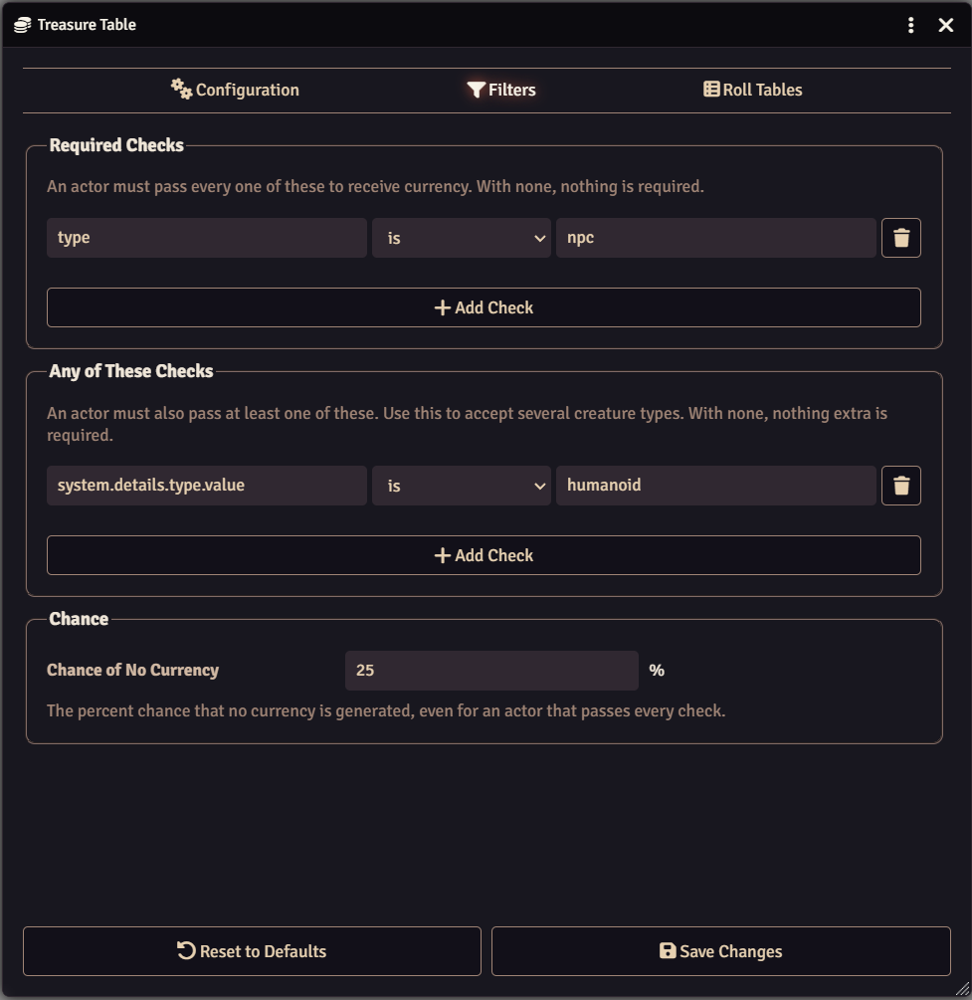
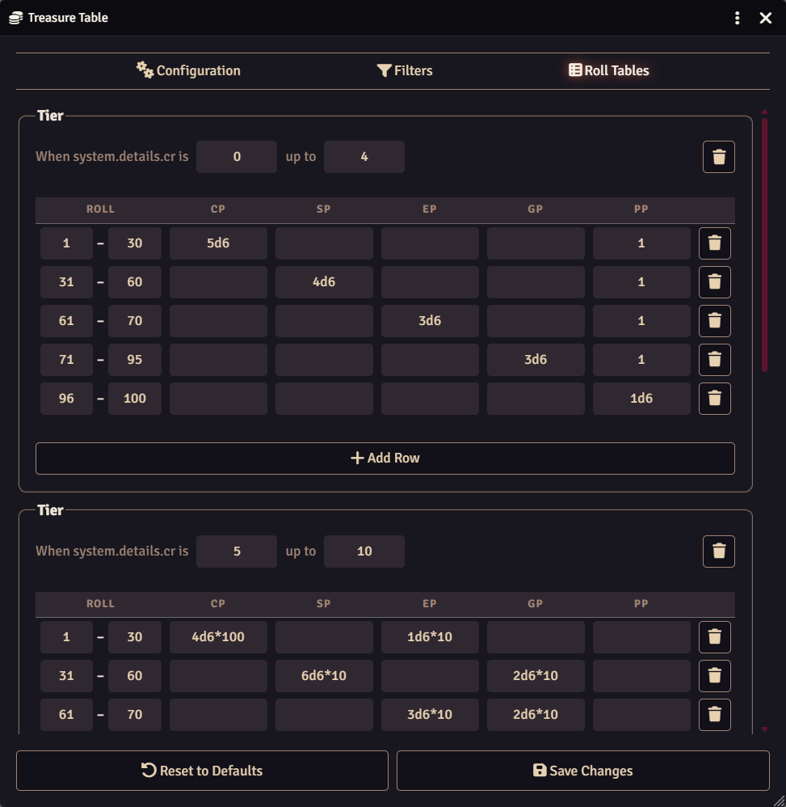
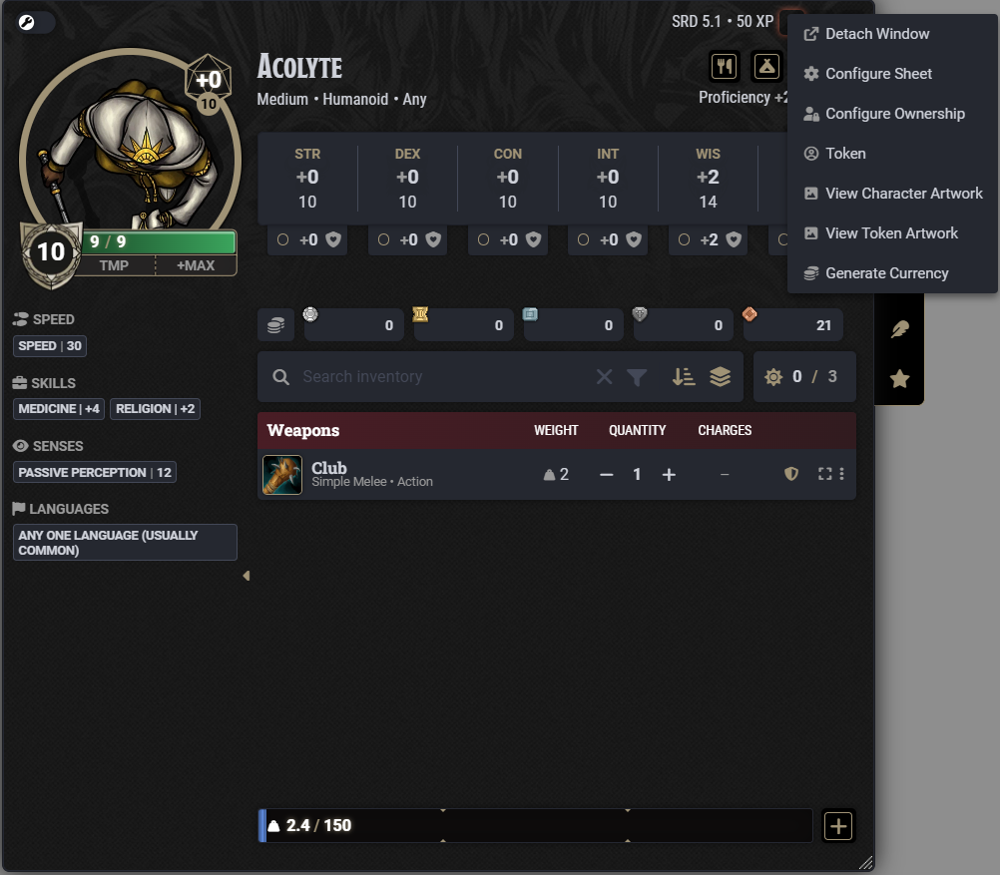
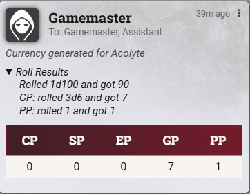

# Pocket Change


<a target="_blank" href="https://foundryvtt.com/packages/dfreds-pocket-change"></a>
<br />
<a target="_blank" href="https://github.com/DFreds/dfreds-pocket-change"></a>

<br/>
<br/>

A FoundryVTT module that automatically adds currency to actors when their tokens
are dropped on the canvas.

## Overview

Pocket Change rolls up money for an actor and writes it onto them, so your
players have something to loot. A treasure table decides how much, and you edit
that table yourself. On dnd5e it arrives filled in with the Individual Treasure
tables by Challenge Rating from the Dungeon Master's Guide, so it works straight
away. On any other system you fill it in to match how that system stores money.

## Features

- Automatically generates currency when a token is dropped on the canvas
- Roll new currency at any time from a button on the actor sheet
- Decide which actors receive currency, and how likely they are to have any
- Works with any game system, with autocomplete for actor values
- Comes set up with the DMG Individual Treasure tables by Challenge Rating on
  dnd5e
- Optionally reports the rolls and the resulting currency in a chat message to
  GMs

## Configuring Treasure

Open **Configure Treasure Table** in the module settings. It has three tabs.

- **Configuration** - the actor value that decides how much treasure is
  generated, such as the challenge rating, the roll used to pick a result, and
  the currencies that get filled in
- **Filters** - which actors receive currency, and the percent chance that none
  is generated at all
- **Roll Tables** - the tiers and rows that turn a roll into an amount


Filters are split into required checks, which an actor must all pass, and any-of
checks, where one is enough. That lets you require an NPC while accepting
several creature types.





:::tip
Anywhere you type an actor value, suggestions appear as you type. A value that
does not look like something actors have is outlined as a warning, but can still
be saved, since some values are calculated rather than stored.
:::

## Generating Currency by Hand

Every actor sheet has a **Generate Currency** control in its header for GMs. It
ignores the filters, and replaces whatever currency the actor is carrying rather
than adding to it, so you can roll until you are happy with the result.



## Settings

| Setting               | Scope | Default | Description                                                          |
| --------------------- | ----- | ------- | -------------------------------------------------------------------- |
| **Enabled**           | World | Yes     | If enabled, currency is generated for tokens dropped in scenes.       |
| **Show Chat Message** | World | No      | If enabled, a chat message is created any time currency is generated. |

The chat message goes to GMs only. It shows every roll that was made and what
each one came to, then the currency the actor ended up with.



Currency is never generated for linked tokens, for actors with a player owner,
or for anyone who is not a GM.

## For Developers

```js
const api = game.modules.get("dfreds-pocket-change").api;

// Add rolled currency on top of what the actor already carries
await api.generateCurrencyForActor(actor);

// Throw away what they carry and roll fresh, like the sheet control does
await api.generateCurrencyForActor(actor, { replace: true });
```

The filters and the chance of no currency are not applied, since you asked for
it directly.
