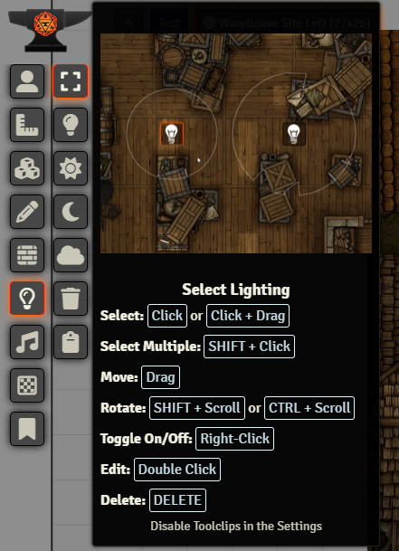
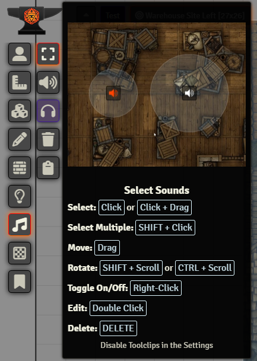
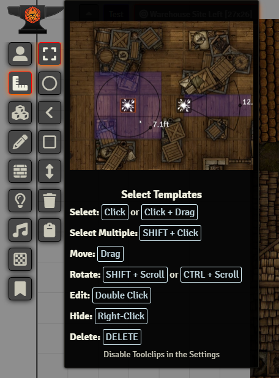

# DFreds Select Tool

A FoundryVTT module that adds a select tool to all layers.

Foundry page: https://foundryvtt.com/packages/dfreds-select-tool

    
Metadata

    
    
    
     
     
    
    
     
    
    

## Let Me Sell You This

Did you ever think it was weird that you could select multiple tokens, tiles,
drawings, and walls, but you couldn't select multiple templates, lights, sounds,
or notes? Well, this module is for you!

## What This Module Does

This module adds a select tool to all layers, including templates, lights,
sounds, and notes.

Lighting:

Sounds:

Templates:

## Required Modules

- [Lib: DFreds UI Extender](https://foundryvtt.com/packages/lib-dfreds-ui-extender) by DFreds (that's me) - A library that makes it easy to add new UI elements to Foundry

## Modules That Help

- [DFreds Clipboard](https://www.patreon.com/dfreds/shop/dfreds-clipboard-v1-0-0-1159963) by DFreds
  (that's me) - One of my premium FoundryVTT modules that adds a clipboard
  application to the game that keeps track of the items you copied. It pairs
  nicely with this module.

