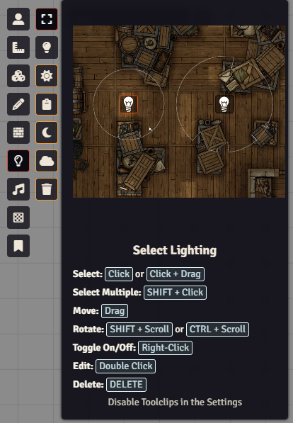
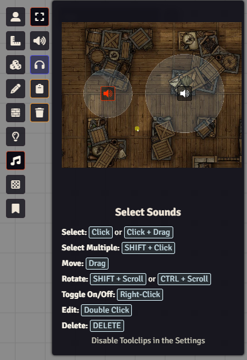
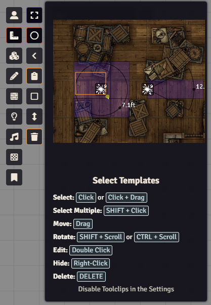

# Select Tool

 

 
 

A FoundryVTT module that adds a select tool to all layers.

## Overview

Select Tool enhances Foundry VTT's layer controls by adding selection
capabilities to all layers. While Foundry natively supports selecting multiple
tokens, tiles, drawings, and walls, this module extends that functionality to
templates, lights, sounds, and notes.

With Select Tool, you can now select, copy, and paste multiple items on any
layer, providing a consistent and intuitive workflow across all aspects of scene
management.

## Features

- Adds a select tool to all layers, including templates, lights, sounds and notes
- Copy and paste multiple items like any other layer

## Showcase

### Lighting

### Sounds

### Templates

## Required Modules

- [Lib: DFreds UI Extender](https://foundryvtt.com/packages/lib-dfreds-ui-extender) - A library that makes it easy to add new UI elements to Foundry

## Helpful Modules

- [DFreds Clipboard](https://www.patreon.com/dfreds/shop/dfreds-clipboard-v1-0-0-1159963) by DFreds - One of my premium FoundryVTT modules that adds a clipboard
  application to the game that keeps track of the items you copied. It pairs
  nicely with this module.

