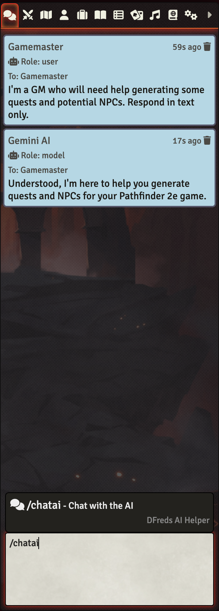
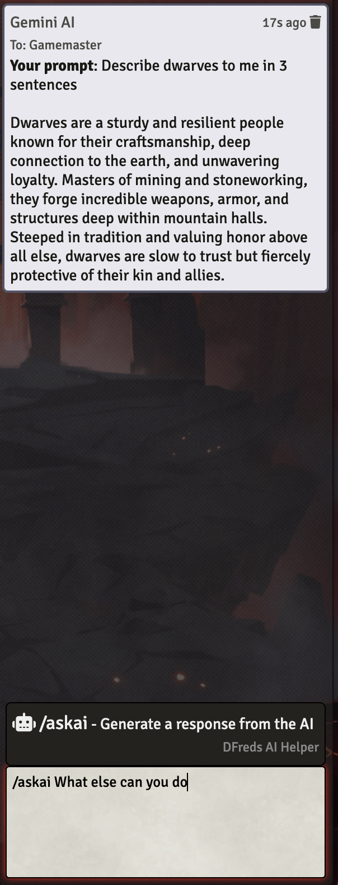
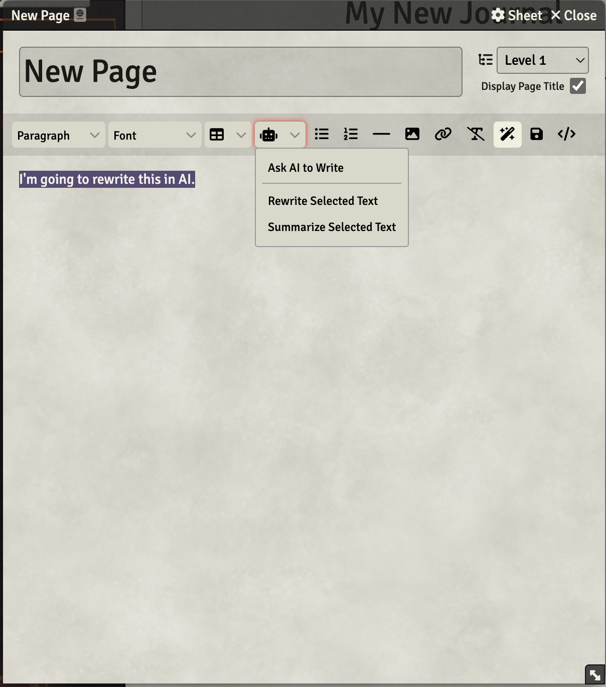
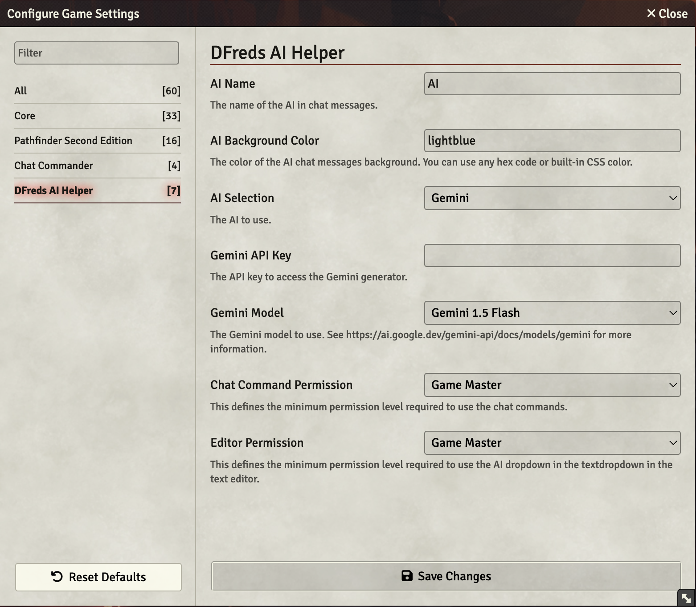

# AI Helper

<!--  -->

 

<!--  -->
 
 

A FoundryVTT module that uses AI to help in your game.

## Overview

AI Helper enhances Foundry VTT by integrating artificial intelligence
capabilities directly into your gaming experience. Whether you're facing
writer's block while crafting character biographies, need help summarizing
lengthy text, or want assistance generating creative content, this module
leverages AI to streamline your creative process.

The module seamlessly integrates with Foundry's chat system and text editors,
providing multiple ways to interact with AI. Through chat commands, you can
engage in persistent conversations with an AI that maintains context, or ask
one-off questions about your game system. Additionally, the module adds
convenient editor buttons that allow you to manipulate selected text or generate
new content directly within any text editor.

## Features

- Chat with an AI that remembers your conversations using the Foundry built-in chat messages
 - Ask one-off questions about anything related to your system
 - Use AI in text editors to summarize or rewrite selected text
 - Use AI in text editors to create new documents by providing a prompt

## Configuration

Settings are provided to configure the module.

## Generating API Keys

For the time being, the only AI supported is Gemini. Others will be added later.

### Gemini

To generate an API key for Gemini, go to this link after logging in:
https://aistudio.google.com/apikey

You'll then need to copy and paste that API key into the settings of the module.

Note that Gemini is free for the moment.

## Required Modules

- [Chat Commander](https://foundryvtt.com/packages/_chatcommands) by DJ Addi - A
library that allows easy creation of new chat commands. It also has the benefits
of displaying all default, available commands when typing `/` in chat!
