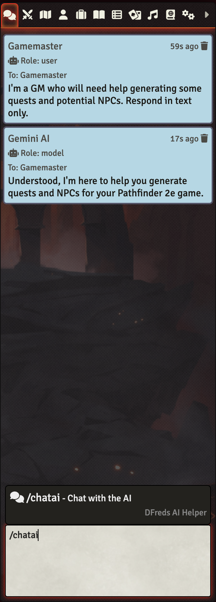
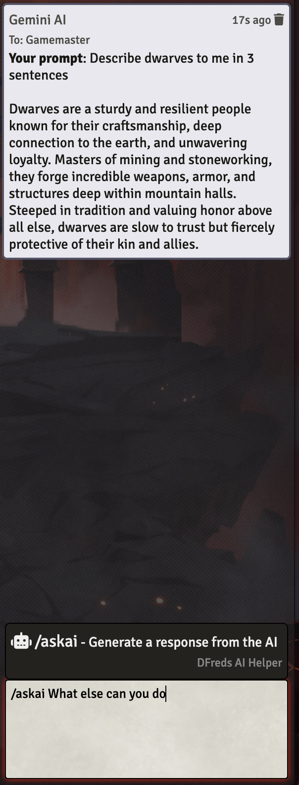
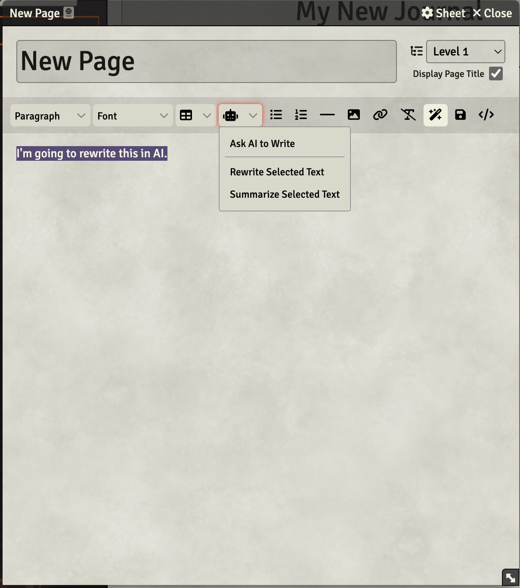
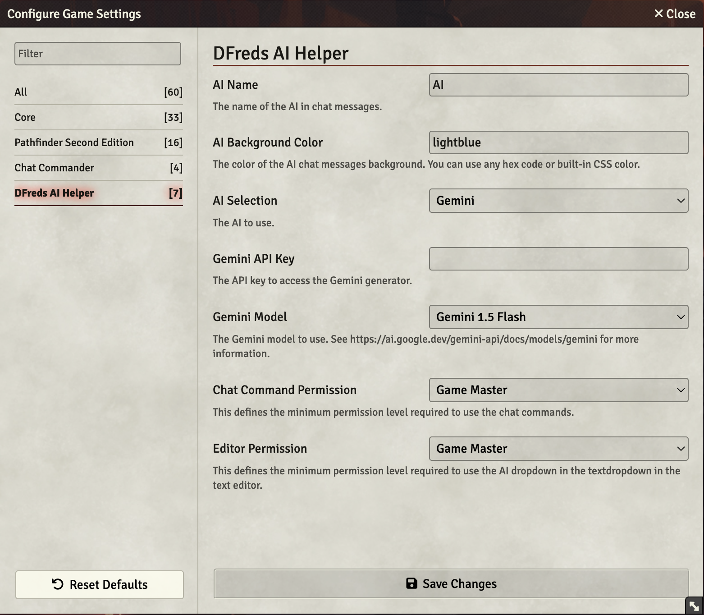

# DFreds AI Helper

A FoundryVTT module that uses AI to help in your game.

## Let Me Sell You This

Ever get a creative block? Don't like how you wrote a biography, or want it summarized? Use the power of "AI"!

## What This Module Does

This module adds some chat commands to talk to an AI. It also adds some new editor buttons to manipulate any selected text.

Chat with an AI that remembers your conversation:

Ask it a one-off questions:

Use it directly in text editors:

You can configure some stuff:

## Generating API Keys

For the time being, the only AI supported is Gemini. Others will be added later.

### Gemini

To generate an API key for Gemini, go to this link after logging in:
https://aistudio.google.com/apikey

You'll then need to copy and paste that API key into the settings of the module.

Note that Gemini is free for the moment.

## Required Modules

- [Chat Commander](https://foundryvtt.com/packages/_chatcommands) by DJ Addi - A
library that allows easy creation of new chat commands. It also has the benefits
of displaying all default, available commands when typing `/` in chat!
