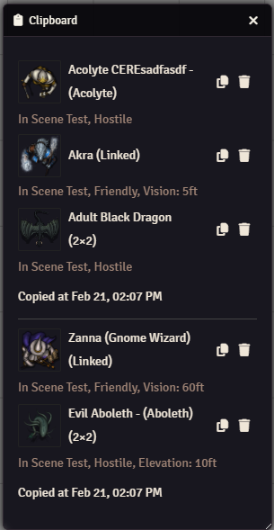
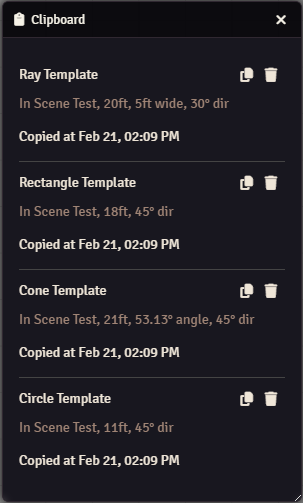
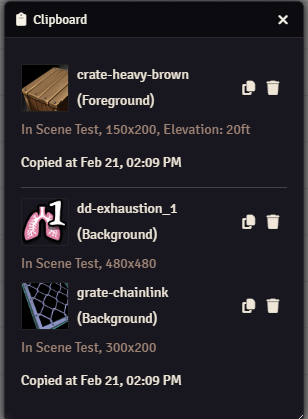
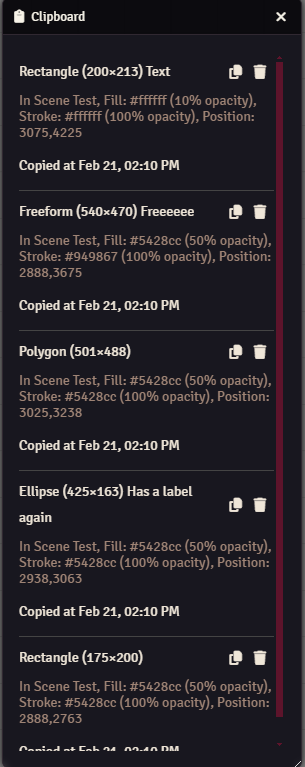
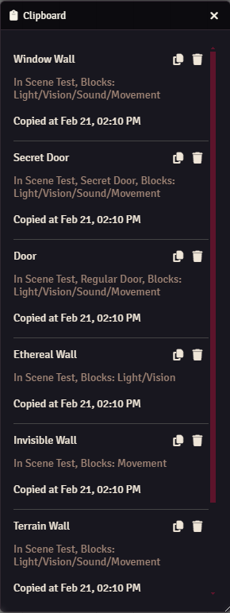
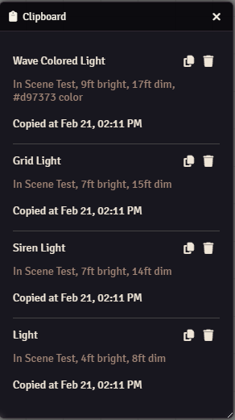
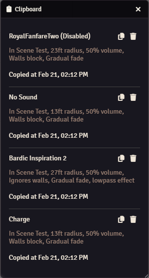
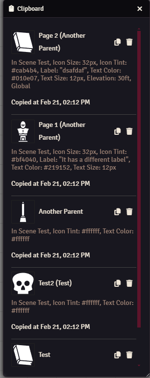
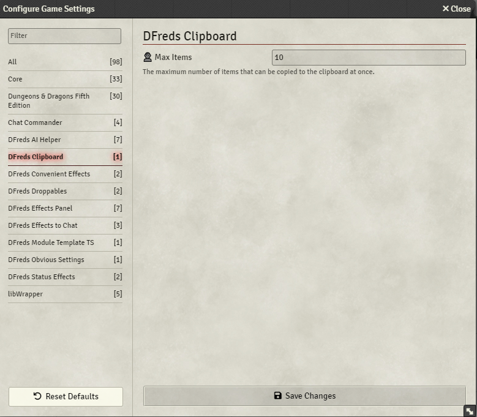

# DFreds Clipboard

 
 

A FoundryVTT module that adds a clipboard application to the game that keeps track of the items you copied.

## Let Me Sell You This

Ever need to copy several items from one scene to the next? Hate how you have to
re-copy the same items over and over again? Well, this module is for you!

## What This Module Does

This module adds a clipboard application to the game that keeps track of all
placeable items that have been copied for the current session.

Copied tokens:

Copied templates:

Copied tiles:

Copied drawings:

Copied walls:

Copied lights:

Copied sounds:

Copied notes:

You can configure some stuff:

## Keybindings

You can toggle the clipboard application with `Ctrl+Shift+C` by default.

## Required Modules

- [libWrapper](https://foundryvtt.com/packages/lib-wrapper) by ruipin - A
  library that wraps core Foundry methods to make it easier for module
  developers to add functionality. Note that if you for some reason don't want
  to install this, a shim will be used instead.
- [Lib: DFreds UI Extender](https://foundryvtt.com/packages/lib-dfreds-ui-extender) by DFreds (that's me) - A library that makes it easy to add new UI elements to Foundry
