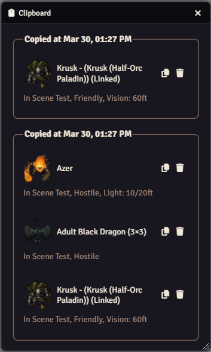
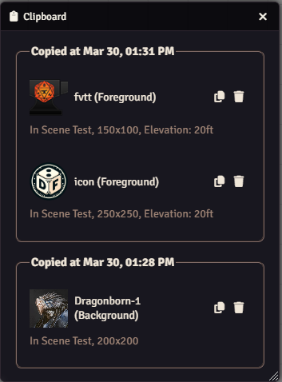
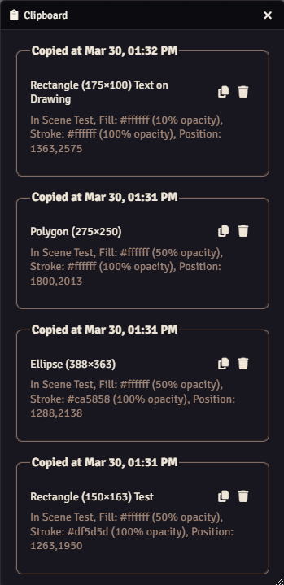
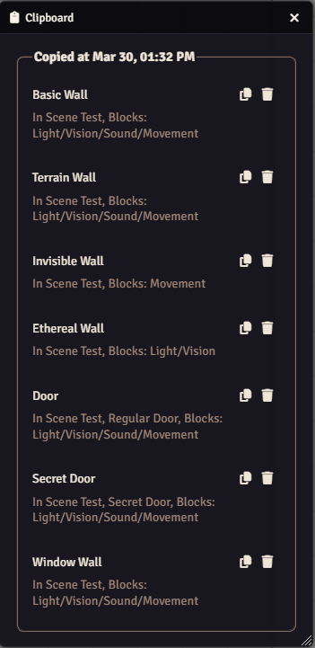
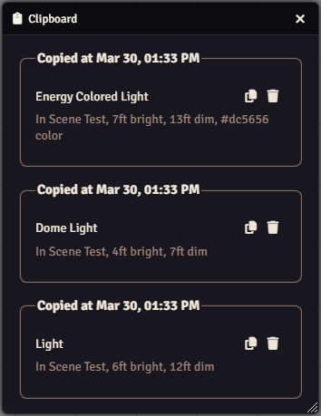
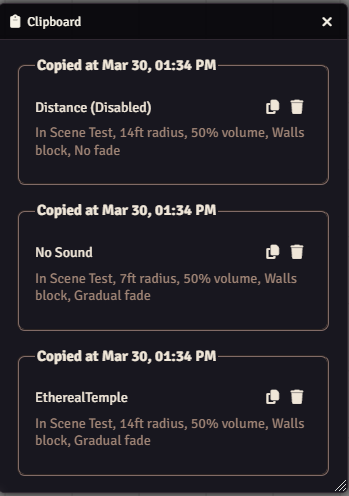
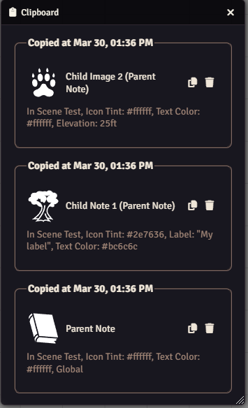

# Clipboard

 

 
 

A FoundryVTT module that adds a clipboard application to the game that keeps track of the items you copied.

## Overview

Clipboard enhances Foundry VTT's copy and paste functionality by providing a
persistent clipboard that maintains a history of copied items across scenes.
Whether you're duplicating tokens, templates, tiles, or any other placeable
objects, this module eliminates the frustration of having to repeatedly copy
the same items when working between scenes.

The module adds a dedicated clipboard interface accessible from each layer,
allowing you to view and manage your copied items. You can paste individual
items or entire groups with ease, and your clipboard history persists
throughout your gaming session, making scene setup and management more
efficient than ever.

## Features

- Adds a clipboard button to each layer (tokens, tiles, walls, etc.) that opens a convenient clipboard interface
- Maintains a history of copied items for each layer, making it easy to paste previously copied items individually or all at once
- Remembers copied items between scenes, so you can copy from one scene and paste into another
- Customize how many items are stored in the clipboard history through module settings

## Showcase

### Tokens

### Templates

### Tiles

### Drawings

### Walls

### Lights

### Sounds

### Notes

## Configuration

Settings are provided to configure the module.

## Keybindings

You can toggle the clipboard application with `Ctrl+Shift+C` by default.

## Required Modules

- [libWrapper](https://foundryvtt.com/packages/lib-wrapper) by ruipin - A
  library that wraps core Foundry methods to make it easier for module
  developers to add functionality. Note that if you for some reason don't want
  to install this, a shim will be used instead.
- [Lib: DFreds UI Extender](https://foundryvtt.com/packages/lib-dfreds-ui-extender) by DFreds - A library that makes it easy to add new UI elements to Foundry
