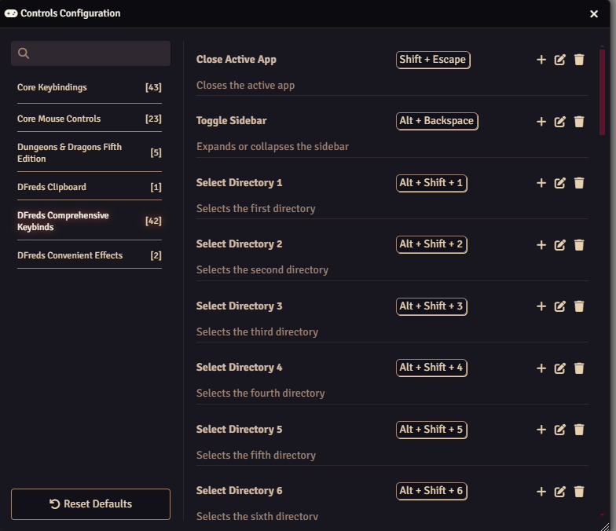

# Comprehensive Keybinds

 

 
 

A FoundryVTT module that adds keybinds to standard Foundry actions.

## Overview

Comprehensive Keybinds adds customizable keyboard shortcuts for quickly selecting controls, tools, and directories in Foundry VTT. It also provides keybinds for toggling directory expansion, changing roll modes, and closing the most recent window. These shortcuts streamline navigation and make common actions faster and more efficient.

## Features

- Adds keybindings for the following actions:
  - Control selection (tokens, lights, templates, etc.)
    - Default keybinds are Ctrl + (1-9, -, =)
  - Tool selection (within tokens, selection, measure, etc.)
    - Default keybinds are Ctrl + Shift + (1-9, -, =)
  - Directory selection (actors, items, scenes, etc.)
    - Default keybinds are Shift + Alt + (1-9, -, =)
  - Toggling directory expansion
    - Default keybind is Alt + Backspace
  - Changing roll mode (public, GM, blind, self)
    - Default keybinding is Alt + Arrow keys
  - Closing the most recent active window only
    - Default keybinding is Shift + Escape
