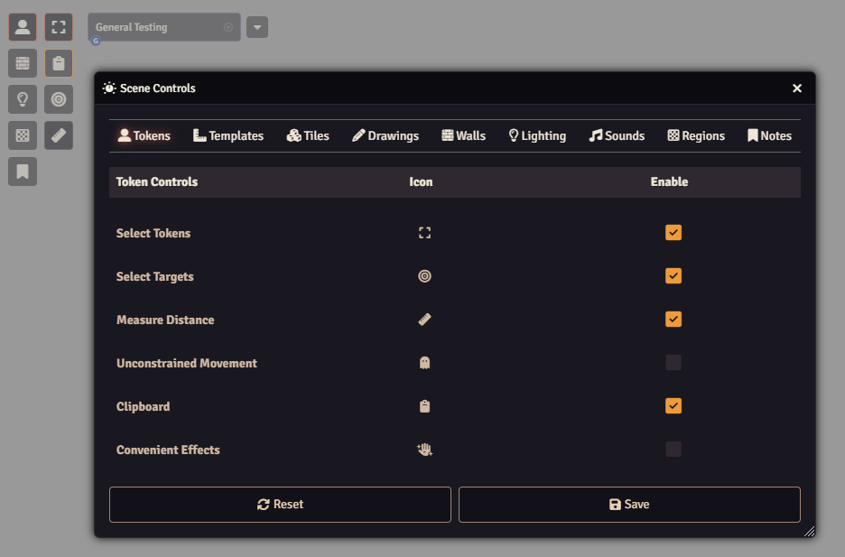
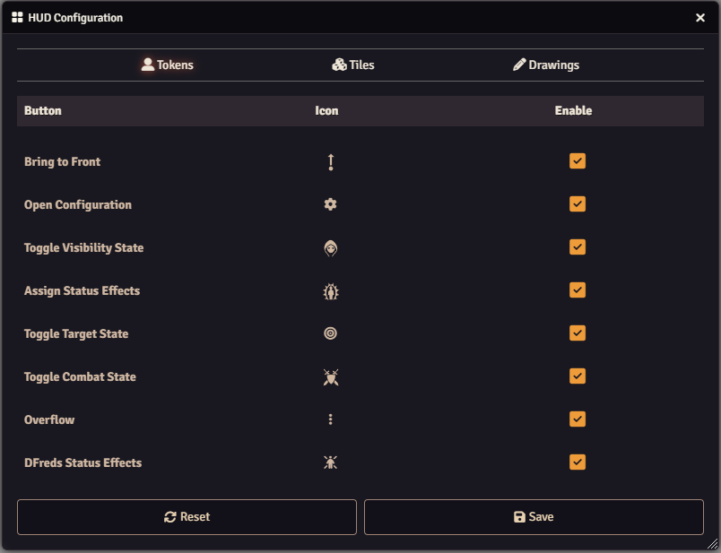
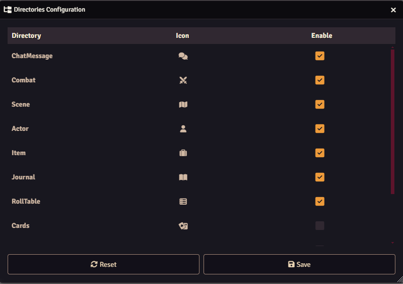
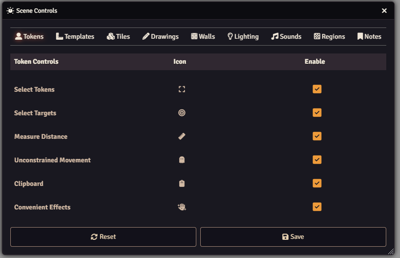

# Picky UI

 

 
 

A FoundryVTT module that allows you to hide aspects of the UI of your game.

## Overview

Picky UI gives you control over which UI elements appear in your game. Through a
simple config menu, you can toggle individual scene controls and entire sections
on or off. When all tools in a section are disabled, that section automatically
disappears, helping maintain a clean and focused interface that displays only
the elements you need.

## Features

- Toggle on and off any HUD elements on tokens, tiles, or drawings
  - Seamlessly works with other modules that add new controls, including those using [Lib: DFreds UI Extender](https://foundryvtt.com/packages/lib-dfreds-ui-extender)
- Toggle on and off any sidebar directories (except Settings)
- Toggle on and off any scene controls 
  - Automatically hides entire sections when all contained tools are disabled
  - Seamlessly works with other modules that add new controls, including those using [Lib: DFreds UI Extender](https://foundryvtt.com/packages/lib-dfreds-ui-extender)
- Toggle on and off the chat notifications, player list, hotbar, or scene navigation

## Settings

Every setting is client-scoped, so each player configures their own and nothing
you change affects anyone else at the table.

| Setting                        | Default | Description                                   |
| ------------------------------ | ------- | --------------------------------------------- |
| **Enable Chat Notifications**  | Enabled | Whether chat notifications appear.            |
| **Enable Player List**         | Enabled | Whether the player list appears.              |
| **Enable Hotbar**              | Enabled | Whether the hotbar appears.                   |
| **Enable Scene Navigation**    | Enabled | Whether the scene navigation appears.         |

Three further config menus sit alongside these, each opening its own dialog:

| Menu             | Description                                    |
| ---------------- | ---------------------------------------------- |
| **Directories**  | Configure which sidebar directories appear.    |
| **HUD**          | Configure which HUD buttons appear.            |
| **Scene Controls** | Configure which scene control buttons appear. |

:::info
The three config menus store their choices per game system, so a layout you set
up in one system will not carry over to a world running a different one.
:::

Configure the HUD on tokens, tiles, and drawings:

Configure the sidebar directories:

Configure the scene controls:

