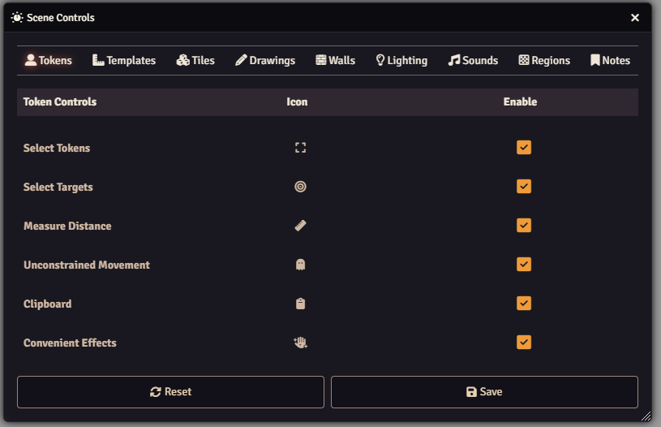

# Picky UI

 

 
 

A FoundryVTT module that allows you to hide aspects of the UI of your game.

## Overview

Picky UI gives you control over which UI elements appear in your game. Through a
simple config menu, you can toggle individual scene controls and entire sections
on or off. When all tools in a section are disabled, that section automatically
disappears, helping maintain a clean and focused interface that displays only
the elements you need.

## Features

- Toggle individual sidebar directories on/off through configuration menu
- Toggle individual scene controls on/off through configuration menu
  - Automatically hides entire sections when all contained tools are disabled
  - Seamlessly works with other modules that add new controls, including those using [Lib: DFreds UI Extender](https://foundryvtt.com/packages/lib-dfreds-ui-extender)

## Configuration

Settings are provided to configure the module.

Configure the sidebar directories:

Configure the scene controls:

