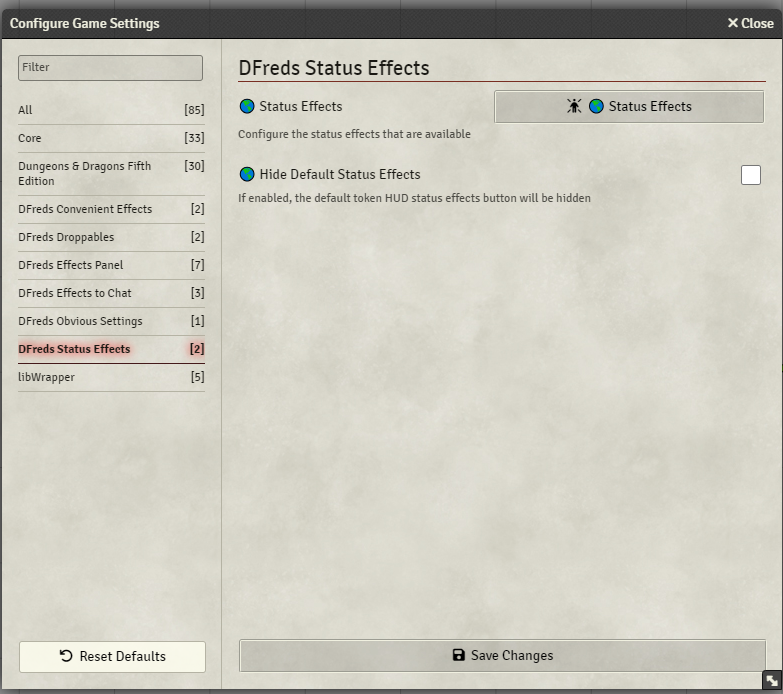
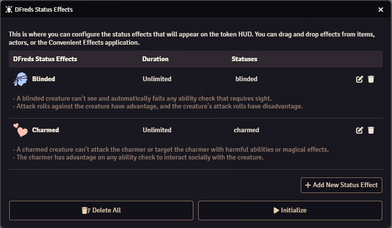
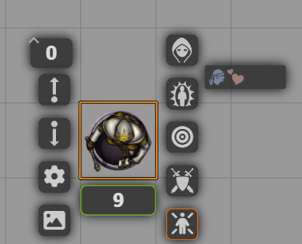

# DFreds Status Effects

A FoundryVTT module that allows configuring and editing of the status effects.

Patreon page: https://www.patreon.com/dfreds/shop/dfreds-status-effects-v1-1-0-1031082

## Let Me Sell You This

Wouldn't it be cool if you could manipulate the status effects that appear on
the token HUD? Maybe you could delete them, edit them, or even create your own.
Wow. Crazy. Anyway, now you can.

## What This Module Does

This module provides an easy-to-use configuration menu to add, edit, or update
any status effects and have them appear on the token HUD. You can also control
the order in the list by dragging and dropping.

You can configure some stuff:

Configure your status effects:

And then view them on the token HUD:

## Required Modules

- [libWrapper](https://foundryvtt.com/packages/lib-wrapper) by ruipin - A
library that wraps core Foundry methods to make it easier for modules
developers. Note that if you for some reason don't want to install this, a shim
will be used instead.
- [Lib: DFreds UI Extender](https://foundryvtt.com/packages/lib-dfreds-ui-extender) by DFreds (that's me) - A library that makes it easy to add new UI elements to Foundry

## Modules That Help

While not strictly required, the functionalities provided by these modules
drastically improve the usage of this module.

- [DFreds ConvenientEffects](https://foundryvtt.com/packages/dfreds-convenient-effects) by DFreds
(that's me) - A module that provides an easy way to create active effects that
can do lots of cool things.
