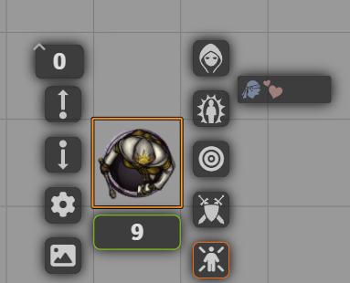
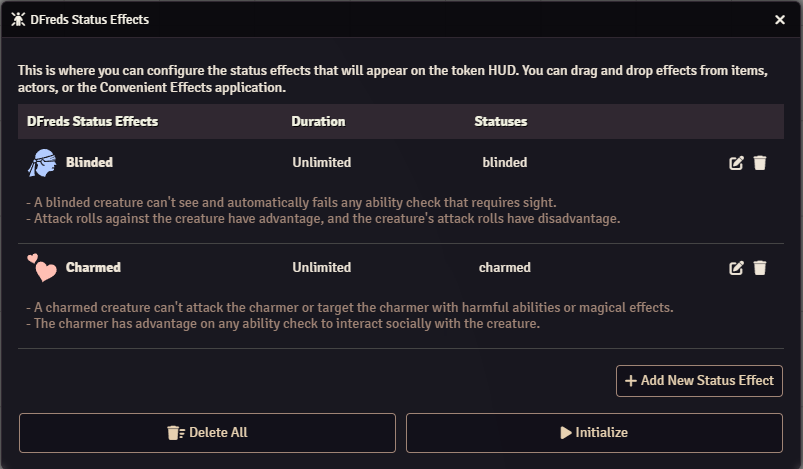

# Status Effects

 

 
 

A FoundryVTT module that allows configuring and editing of the status effects.

## Overview

Status Effects gives you control over which status effects appear on the token
HUD. A configuration sheet lets you create, edit, and drag-and-drop to reorder
them, so you can add custom statuses for your own mechanics or cut the default
set down to what your campaign actually uses.

## Features

- Adds a new button to the token config for new status effects
- Provides a simple to use config sheet to drag/drop or create new status effects
- Optionally allows hiding the default status effects HUD button

## Settings

| Setting                         | Scope | Default  | Description                                       |
| ------------------------------- | ----- | -------- | ------------------------------------------------- |
| **Hide Default Status Effects** | World | Disabled | Hide the default token HUD status effects button. |

Alongside it is one config menu:

| Menu               | Description                                        |
| ------------------ | -------------------------------------------------- |
| **Status Effects** | Configure the status effects that are available.   |

Configure your status effects:

## Required Modules

- [libWrapper](https://foundryvtt.com/packages/lib-wrapper) by ruipin - A
library that wraps core Foundry methods to make it easier for modules
developers. Note that if you for some reason don't want to install this, a shim
will be used instead.
- [Lib: DFreds UI Extender](https://foundryvtt.com/packages/lib-dfreds-ui-extender) by DFreds - A library that makes it easy to add new UI elements to Foundry
- [Lib: DFreds Migrations](https://foundryvtt.com/packages/lib-dfreds-migrations) by DFreds - A library that makes it easy to handle data migrations

## Helpful Modules

While not strictly required, the functionalities provided by these modules
drastically improve the usage of this module.

- [DFreds Convenient Effects](https://foundryvtt.com/packages/dfreds-convenient-effects) by DFreds - A module that provides an easy way to create active effects that
can do lots of cool things.
