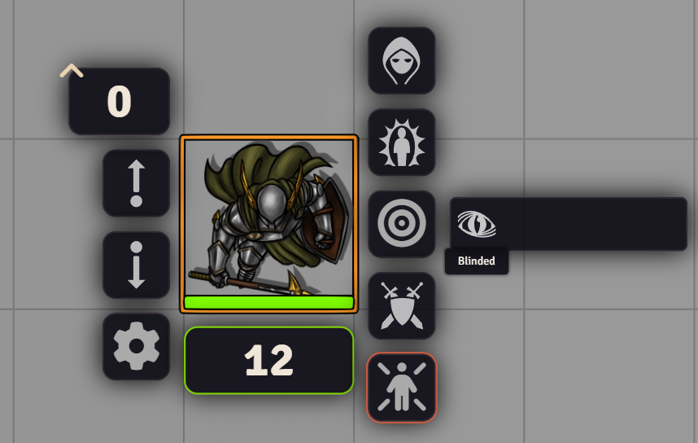
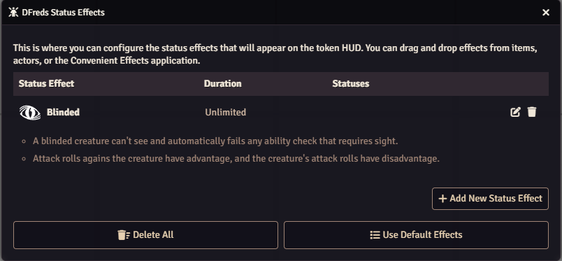

# Status Effects

 

 
 

A FoundryVTT module that allows configuring and editing of the status effects.

## Overview

Status Effects enhances Foundry VTT's token status management by providing
complete control over the status effects that appear on the token HUD. This
module empowers Game Masters to customize their status effect options beyond the
default set, allowing for a more tailored gaming experience.

The module introduces an intuitive configuration interface where users can
create, edit, and organize status effects with ease. Through a simple
drag-and-drop interface, you can reorder status effects to match your preferred
layout, ensuring quick access to the most frequently used statuses during
gameplay.

Whether you need to create custom status effects for unique game mechanics,
modify existing ones to better match your campaign's needs, or simply reorganize
the presentation of status options, Status Effects provides the tools necessary
to streamline your token status management workflow.

## Features

- Adds a new button to the token config for new status effects
- Provides a simple to use config sheet to drag/drop or create new status effects
- Optionally allows hiding the default status effects HUD button

## Configuration

Settings are provided to configure the module.

Configure your status effects:

## Required Modules

- [libWrapper](https://foundryvtt.com/packages/lib-wrapper) by ruipin - A
library that wraps core Foundry methods to make it easier for modules
developers. Note that if you for some reason don't want to install this, a shim
will be used instead.
- [Lib: DFreds UI Extender](https://foundryvtt.com/packages/lib-dfreds-ui-extender) by DFreds - A library that makes it easy to add new UI elements to Foundry
- [Lib: DFreds Migrations](https://foundryvtt.com/packages/lib-dfreds-migrations) by DFreds - A library that makes it easy to handle data migrations

## Helpful Modules

While not strictly required, the functionalities provided by these modules
drastically improve the usage of this module.

- [DFreds Convenient Effects](https://foundryvtt.com/packages/dfreds-convenient-effects) by DFreds - A module that provides an easy way to create active effects that
can do lots of cool things.
