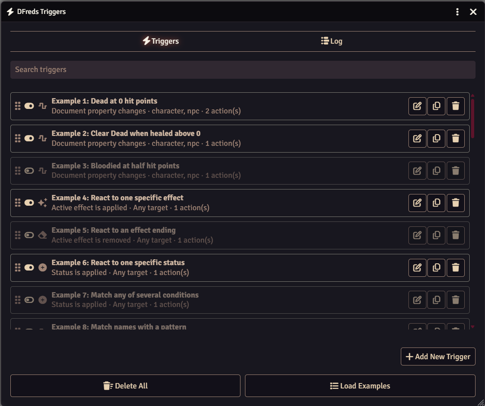

# Triggers

 

 
 

A FoundryVTT module that adds user defined triggers and actions.

## Overview

Triggers allows you to define events, conditions, and actions to help automate
your game. You pick the event to watch for, add conditions that narrow down
when it fires, and then list the actions to run. All triggers can be setup
through the interface rather than written as macros, and anything that is not a
predefined action can still run as a macro or script.

## Features

- Events for document changes, statuses, active effects, combat, tokens, and
  the world
- Conditions that compare against a value, a roll expression, or a pattern
- Actions for effects, documents, chat, combat, sounds, notifications, and delays
- Macro and script actions for anything not covered
- Import and export triggers as JSON
- Comes with fifty pre-built trigger examples
- Includes an API for other modules to add their own events and actions

## Quick Start

1. Open **Configure Triggers** from the module settings
1. Click **Load Examples** at the bottom to add the bundled examples
1. Enable one that looks close to what you want, then edit it in place

The [Examples](./examples) page lists what each of them does.

## Advanced Usage

If you are a regular user, see the [User Guide](./user-guide) for more details
on all the features provided, and [Examples](./examples) for the triggers that
come with the module.

If you are a developer or want to learn how to use the API, check out the
[Developer Guide](./developer-guide).

## Required Modules

- [Lib: DFreds Migrations](https://foundryvtt.com/packages/lib-dfreds-migrations)
  by DFreds - A library that makes it easy to handle data migrations

## Helpful Modules

While not strictly required, the functionalities provided by these modules
drastically improve the usage of this module.

- [DFreds Convenient Effects](https://foundryvtt.com/packages/dfreds-convenient-effects)
  by DFreds - Adds its own action for applying a convenient effect, which handles
  nested and dynamic effects rather than copying an effect directly. It appears
  under Effects in the action picker when the module is active.
