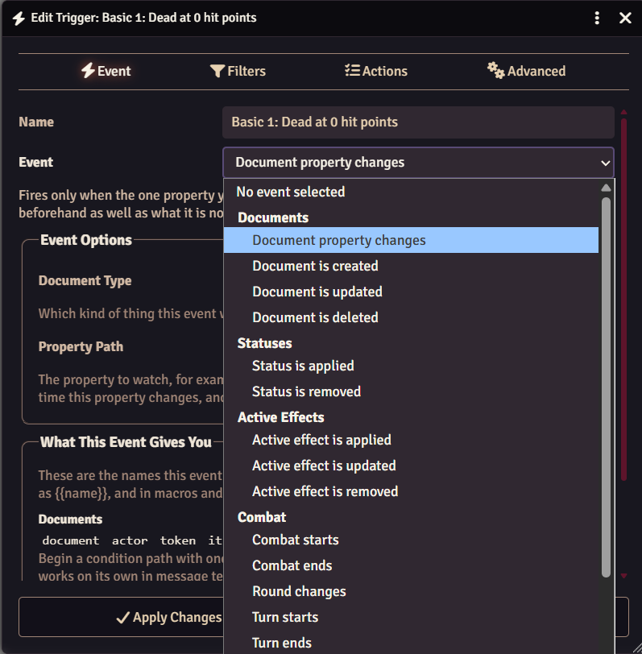
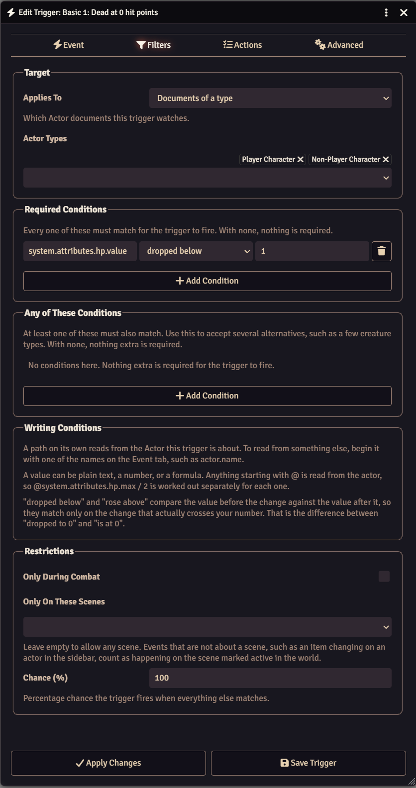
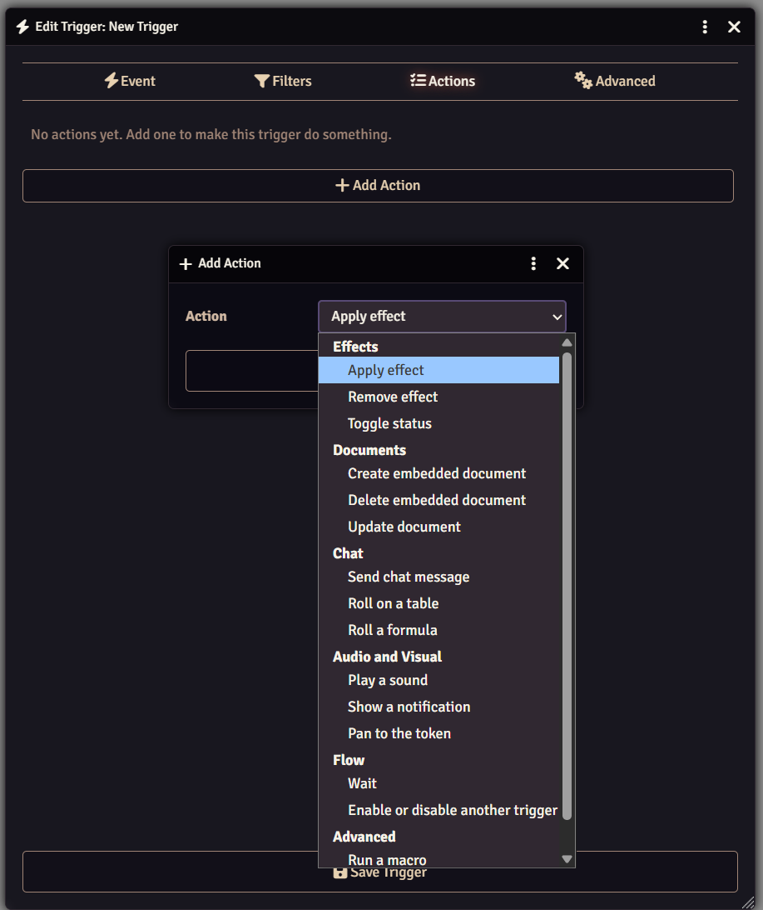

# User Guide

Triggers are created and edited from **Configure Triggers** in the module
settings. Each one is built on three tabs: the event to watch for, the filters
that narrow it down, and the actions to run.

## Events

An event decides what the trigger watches for.

| Group          | Events                                                              |
| -------------- | ------------------------------------------------------------------- |
| Documents      | Document property changes; document is created, updated, or deleted |
| Statuses       | Status is applied or removed                                        |
| Active Effects | Active effect is applied, updated, or removed                       |
| Combat         | Combat starts or ends, round changes, turn starts or ends           |
| Tokens         | Token moves, token is targeted                                      |
| World          | World time changes, game is paused, user connects                   |

:::info
**Document is updated** fires on _any_ change to a document. **Document
property changes** fires only when the property you name is part of an update,
and lets conditions see what that property held before the change.
:::

## Filters

Filters decide whether a trigger that heard its event should actually run.

**Applies To** narrows by document. Leave it on any document, drag in specific
documents, or pick document types.

**Conditions** compare a property against a value. Paths are read from the
document the event is about. For instance, `system.attributes.hp.value` reads the HP of the actor on
an actor event. Start a path with a context name to read from something else:

- `actor.type`
- `effect.name`
- `previous.system.attributes.hp.value`

Values can be plain text or numbers, an expression such as
`@system.attributes.hp.max / 2`, or a regular expression with the pattern
operator. Dice are not rolled here, only in actions.

**Restrictions** limit a trigger to combat, to certain scenes, or to a
percentage chance. An event that is not about a scene counts as happening on
the **active** scene, not the one you have open.

:::tip
The context prefix is how you stop a trigger reacting to its own changes. An
effect trigger that pins down the effect name will ignore any effect it applies
itself.
:::

## Actions

Actions run in order from top to bottom and can be reordered by dragging. If one
of them fails, the rest are skipped, which is covered under
[Execution](#execution).

| Group            | Actions                                                                                                                                              |
| ---------------- | ---------------------------------------------------------------------------------------------------------------------------------------------------- |
| Effects          | Apply effect, remove effect, toggle status                                                                                                           |
| Documents        | Add an item or effect, remove an item or effect, change a property, adjust a number, delete the document, set a flag                                 |
| Chat             | Send chat message, roll on a table, roll a formula                                                                                                   |
| Combat           | Create a combat encounter, start combat, end combat, add or remove from combat, advance to the next turn, advance to the next round, roll initiative |
| Audio and Visual | Play a sound, show a notification, pan to the token, hide or reveal the token, set the token's light, show an image, start or stop a playlist        |
| Flow             | Wait, enable or disable another trigger, run another trigger, target the token, advance world time, pause the game                                   |
| Advanced         | Run a macro, run a script                                                                                                                            |
| Debug            | Show what the event gives you                                                                                                                        |

Each action card shows what that action does under its title.

Every action works on whatever the event was about unless you fill in **Act
On**, which points that one action at a fixed document instead. Chat messages
and notifications accept `{{actor.name}}` style substitution using any of the
names listed on the Event tab.

**Change a property** and **adjust a number** can both roll dice. Type `2d6` to
write a rolled amount, or `-1d4` to take one away. Anything starting with `@` is
read from the target, such as `-@system.details.level`, and the two can be mixed
in one value.

The five actions that happen on a player's own screen - play a sound, show a
notification, pan to the token, show an image, and target the token - also pick
an audience. Note that a gamemaster owns every actor, so **Owners** reaches them
on everyone's turn. **Player Owners** is the one that leaves them out.

### Sharing One List of Actions

**Run another trigger** runs a second trigger's on whatever set the first one
off. Its event, its conditions, and its on or off switch are all skipped, so a
trigger written only to be run this way can be left switched off and still do
its job.

This is how several triggers share one list of actions: put the actions in a
trigger of their own, point each of the others at it, and editing that one list
changes what all of them do.

### Finding Out What Went Wrong

**Show what the event gives you** writes every name the event carries, and the
value it holds, to the browser console. Add it to a trigger, set the trigger
off, and open the console (F12 or Ctrl+Shift+I or Cmd+Shift+I) to see the
provided values. It is the easiest way to work out why a condition or a message
is not reading what you expected.

### What a Macro or Script Receives

**Run a macro** and **run a script** both get the trigger context handed to
them: a macro as named arguments, a script as variables already in scope. You
never have to unpack anything.

| Name                  | What it is                                                               |
| --------------------- | ------------------------------------------------------------------------ |
| `document`            | What the event was about.                                                |
| `actor`               | The actor involved.                                                      |
| `token`               | The token **drawn on the canvas**. See the warning below.                |
| `tokenDocument`       | The token's document, wherever it is placed. Use this to read its data.  |
| `item`, `effect`      | The item or active effect involved.                                      |
| `combat`, `combatant` | The combat and combatant involved.                                       |
| `region`, `scene`     | The region and scene involved.                                           |
| `user`                | The user whose action set the trigger off.                               |
| `changed`, `previous` | The update data, and the values from before it. `{}` when not an update. |
| `statusId`            | The status involved, for status events.                                  |
| `event`               | The id of the event that fired.                                          |
| `trigger`             | The trigger itself, including its name and id.                           |
| `speaker`             | A speaker object, ready to hand to `ChatMessage.create`.                 |
| `depth`               | How many triggers deep this one is. Counted for you.                     |

Every name is always defined, so you never get a reference error. The ones the
event does not provide are `null` instead, and the Event tab lists which names a
given event fills in.

:::warning
`token` is the token as drawn on the canvas, not its document. Triggers run on
the gamemaster's client, so `token` is `null` whenever that gamemaster is not
looking at the scene the token is on. In plain terms, a script that works while
you watch a fight will stop working the moment you switch scenes. Read data off
`tokenDocument`, which is there for any actor with a token placed on a scene no
matter which scene is open, and keep `token` for things that only make sense on
screen.
:::

## Execution

Foundry hooks fire on every connected client, but triggers only run on the
gamemaster's, which is what stops a trigger firing once per connected player.
Notifications and sounds are then passed along to the players who should get
them. Macros and scripts run with gamemaster permissions, and scripts need the
Use Script Macros permission.

:::warning
Triggers do not fire when no gamemaster is logged in. The module warns you about
this on load if the world has triggers configured.
:::

Actions run one at a time, from the top of the list down, and each one finishes
before the next starts. If an action fails, the trigger stops there and the
actions below it do not run. This is by design, as an action further down the
list can count on one above it having executing successfully. A script that
cannot find what it is looking for, or an action pointed at something that has
since been deleted, will end the run.

The Log tab records how many actions ran before the trigger stopped, along with
the error, so a run that ends early is easy to tell apart from one that finished.

## Recursion

An action that changes a document can cause events that fire other triggers.
Every change a trigger makes is stamped with how deep in a chain it is, and the
chain stops at the configured maximum depth. Raise **Maximum Trigger Depth** if
you are chaining triggers on purpose. If you are not, hitting the limit usually
means a trigger is reacting to its own changes, and a condition that pins down
what it should match is the fix.

## Examples

The module ships with fifty examples covering every event and action.
**Load Examples** at the bottom of the configuration window adds them all to your
world, switched off so you can turn them on one at a time. Loading them again
refreshes them in place rather than making duplicates, and leaves your own
triggers alone.

See [Examples](./examples) for what each one does.

## Sharing Triggers

**Export** at the bottom of the configuration window writes every trigger in the
world to a file. **Import** reads one back and asks how it should arrive:

- **Add** keeps the triggers you already have and puts the imported ones after
  them.
- **Replace All** deletes every trigger in the world first.

Either way, an imported trigger takes the place of one you already have with the
same id. That is what lets you export a set of triggers, change them elsewhere,
and import them again to update them rather than end up with two of each.

## Logging

The Log tab records each trigger run for the current session, including what
fired it, what it acted on, how many actions ran, and any error. It clears on
reload.

When a trigger is not firing and it is not clear why, turn on **Verbose
Logging**. The browser console then names the filter that rejected each trigger.

## Settings

| Setting                   | Scope  | Default  | Description                                                                             |
| ------------------------- | ------ | -------- | --------------------------------------------------------------------------------------- |
| **Maximum Trigger Depth** | World  | 3        | How many times a trigger may cause another trigger to fire before the chain is stopped. |
| **Verbose Logging**       | Client | Disabled | Write extra detail to the browser console when triggers are evaluated.                  |

Alongside them is one config menu:

| Menu                   | Description                                     |
| ---------------------- | ----------------------------------------------- |
| **Configure Triggers** | Create and edit triggers, and view the run log. |
